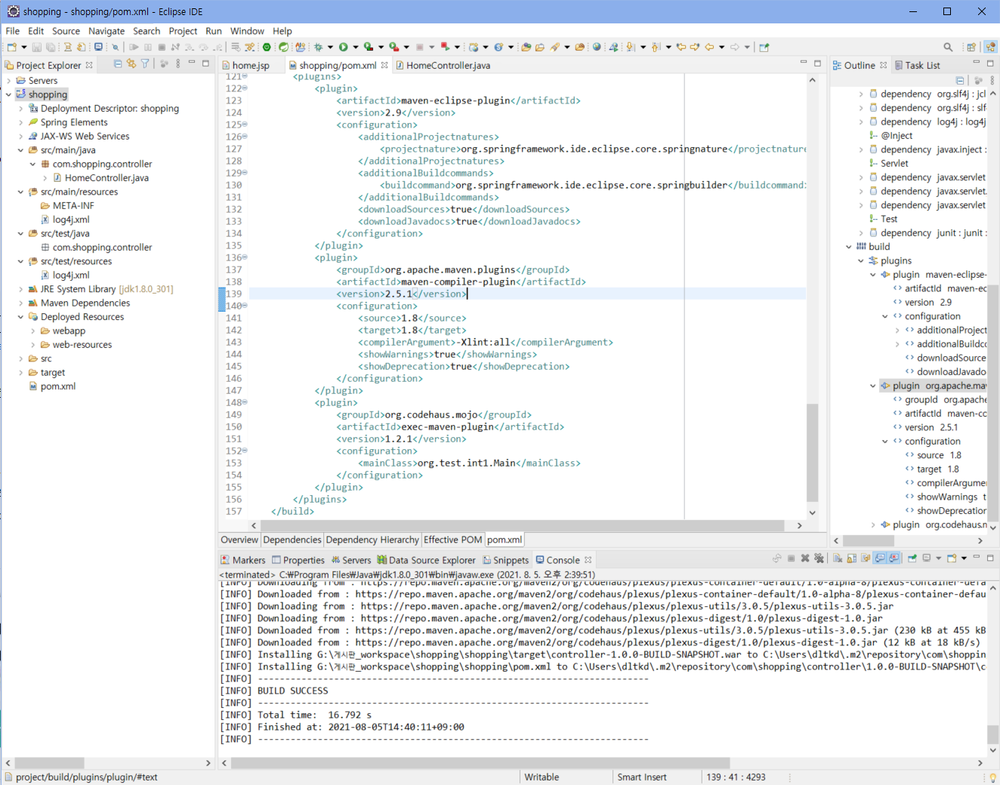

## 0. 프로젝트 생성 및 기본 환경설정

> #### 새로운 MVC 프로젝트 생성 및 스프링 / 자바 버전 변경
>
> - 목차
>   - MVC 프로젝트 생성
>   - tomcat 연동
>   - 환경설정
>   - Spring 버전 변경

 

---

### 1) MVC 프로젝트 생성

file - new - spring legacy project ( 없는 경우 help - eclipse marketplace 에서 sts 3 install 하기)

(현재 이미 shopping이 있어서 저렇게 뜨지만 저렇게 하고 next 한 후 )

저렇게 입력해준다. 

---

### 2) tomcat 연동

file - new - server

---

### 3) 환경설정

- 이클립스 한글 깨짐 방지

window - preferences - encoding 검색

UTF-8로 설정

ISO 10646/Unicode(UTF-8)로 변경

-> 동일 과정을 HTML, JSP, XML 모두에 적용

---

### 4) Spring 버전 설정

- pom.xml 파일의 spring framework 버전 변경하기
  - 3.1.1 -> 5.2.8

버전이 잘 변경되었는지 Maven Dependencies 폴더를 열어 확인할 수 있다. 

---

내 프로젝트 - properties

자바 버전을 내가 설정한 버전으로 변경해준다. 

- 자바 컴파일러 부분도 Use compilance from ... 부분을 체크해제하여 버전을 변경해준다. 

  

- pom.xml 파일을 열어 java version 을 변경

  

maven-compiler-plugin 의 버전 변경

-> 오류가 떠서 2.5.1 사용

