## 0. 프로젝트 생성 및 기본 환경설정 2

> #### 테스트/로그 라이브러리 추가, JUnit 라이브러리 버전 변경(의존성 주입 테스트)
>
> - 목차
>   - 필요 라이브러리
>   - 예제 객체 생성
>   - xml 설정을 통한 의존성 주입 설정 및 테스트
>   - Java 설정을 이용한 의존성 주입 설정 및 테스트(선택)


### - 의존성 주입이란? 

- **의존성 주입(Dependency Injection)**: 어떤 객체가 필요한 객체를 외부에서 밀어 넣는 것
  - **의존성(Dependency)**: 하나의 객체가 다른 객체 없이 제대로 된 역할을 하지 못하는 것
  - **주입(Injection)**: 외부에서 밀어 넣는 것
  - 스프링은 ApplicationContext를 통해 객체들을 관리하여 의존성 주입을 구현
  - 스프링에서 ApplicationContext가 관리하는 객체들을 빈(Bean)이라고 부름
  - 빈과 빈 사이의 의존관계는 xml설정, 어노테이션설정, Java설정 방식을 통해 정의할 수 있음

<br>

- 의존성 주입의 장점
  - 주입을 받는 입장에서는 어떤 객체인지 신경쓸 필요가 없음
  - 어떤 객체에 의존하든 자신의 역할은 변하지 않음

<br>

- 예시

  - 객체 A는 객체 B에 의존적이라고 가정
  - 객체 A는 자신의 역할을 수행하기 위해 객체 B를 직접 호출하여 자신의 역할을 수행한다. 

  

  <br>

  - 의존성 주입을 적용할 경우 객체 A는 스프링(ApplicationContext)에 객체 B가 필요하다는 요청 보냄
  - 이에 따라 스프링(ApplicationContext)는 객체 B를 호출하여 객체 A에 주입함

  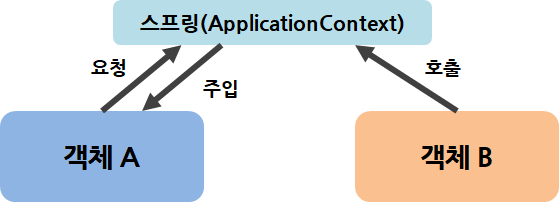

<br>

---

### 1) 필요 라이브러리

- 의존성 주입 기능을 위해 pom.xml에서 다음 라이브러리들을 추가한다. 
  - `spring-test`
  - `lombok`
  - `log4j`(기존의 log4j는 삭제)
- 다음 라이브러리는 변경한다. 
  - `Junit`(변경 전 version -> 4.12)

<br>

- 라이브러리 설명

`spring-test`: @RunWith/ @ContextConfiguration 등의 어노테이션을 활용하여 Spring Framework에서 조금 더 편하게 테스트 지원할 수 있도록 해줌

`lombok`: 자바 컴파일 시점에서 특정 어노테이션으로 해당 코드를 추가할 수 있는 라이브러리

`log4j`: 로그문의 출력을 다양한 대상으로 할 수 있도록 도와주는 도구

`Junit`: Java에서 독립된 단위 테스트를 지원해주는 프레임워크

---

- 기존의 log4j 라이브러리 태그 주석처리 

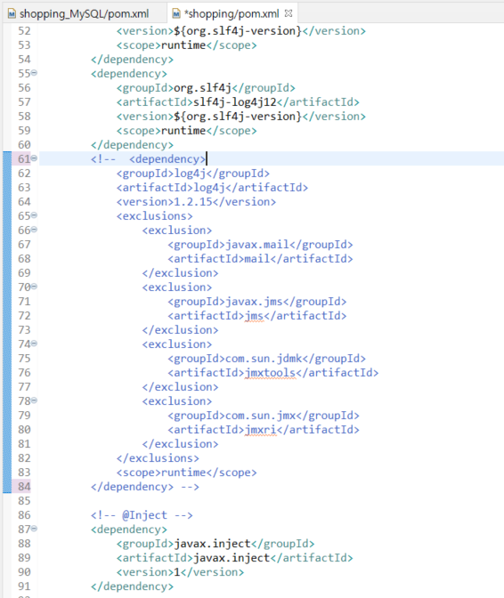

<br>

- 새로운 log4j, spring-test 라이브러리 추가

  ```xml
  		<!-- log4j 추가 -->
  		 <!-- https://mvnrepository.com/artifact/log4j/log4j -->
  		<dependency>
  		    <groupId>log4j</groupId>
  		    <artifactId>log4j</artifactId>
  		    <version>1.2.17</version>
  		</dependency>
  		 
  		<!-- spring-test 추가 -->
  		<!-- https://mvnrepository.com/artifact/org.springframework/spring-test -->
  		<dependency>
  		    <groupId>org.springframework</groupId>
  		    <artifactId>spring-test</artifactId>
  		    <version>${org.springframework-version}</version>
  		    <scope>test</scope>
  		</dependency>
  ```

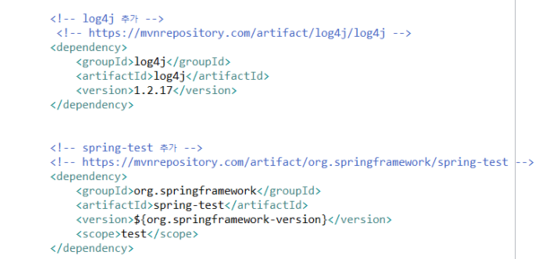

<br>

- 기존 Junit 라이브러리 태그 버전 변경
  - 4.12

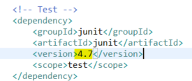

<br>

- lombok 라이브러리 추가

  - [lombok 홈페이지](https://projectlombok.org/download) 접속하여 lombok.jar 파일 다운로드

  - lombok.jar 파일 실행

    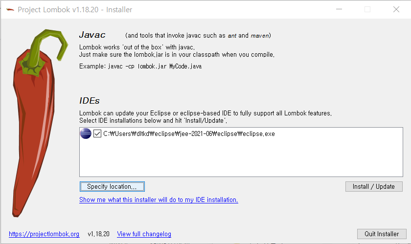

    

    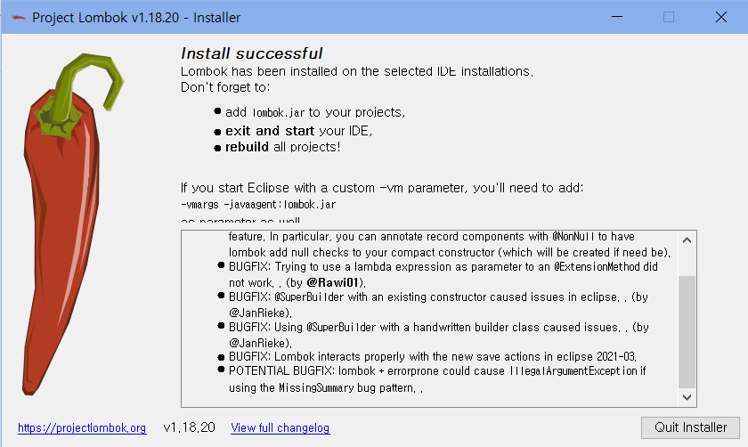

    성공적으로 설치되었다. 

  - 설치된 것 확인하기 위해 eclipse.ini에 내용 추가 된 것을 확인하자.

    - vmargs
    - javaagent:lombok.jar

  - sts 재시작 후 pom.xml에 lombok 추가

    ```xml
    <!-- lombok 추가 -->
    <dependency>
        <groupId>org.projectlombok</groupId>
        <artifactId>lombok</artifactId>
        <version>1.18.12</version>
        <scope>provided</scope>
    </dependency>
    ```

  

---

### 2) 예제 객체 생성

- src/main/java - com.프로젝트명.sample 패키지 생성 
- Restaurant.java, Chef.java 클래스 생성

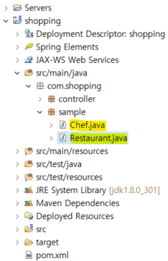


- Chef.java

  ```java
  package com.shopping.sample;
  
  import org.springframework.stereotype.Component;
  import lombok.Data;
  
  @Component
  @Data
  
  public class Chef {
  
  }
  ```

  - `@Component`를 통해 해당 객체는 스프링에서 관리되어야 하는 객체로 인식됨
  - `@Data`를 통해 해당 객체의 Getter/Setter/toString이 자동 형성됨


- Restaurant.java

  ```java
  package com.shopping.sample;
   
  import org.springframework.beans.factory.annotation.Autowired;
  import org.springframework.stereotype.Component;
   
  import lombok.Data;
  import lombok.Setter;
   
  @Component
  @Data
  public class Restaurant {
   
  	@Setter(onMethod_ = @Autowired)
  	private Chef chef;
  }
  ```

  - `@setter(onMethod_ = @Autowired)`로 인해 Chef클래스가 자동 주입됨
  - `@Autowired`는 스프링 내부에서 자신이 특정한 객체에 의존적이므로 자신에게 해당 타입의 빈을 주입하라는 표시


---

### 3) xml 설정을 통한 의존성 주입 설정 및 테스트

#### 3-1) root-context.xml 설정

- src/main/webapp/WEB-INF/spring/root-context.xml - 하단의 Namespaces - context 항목 체크

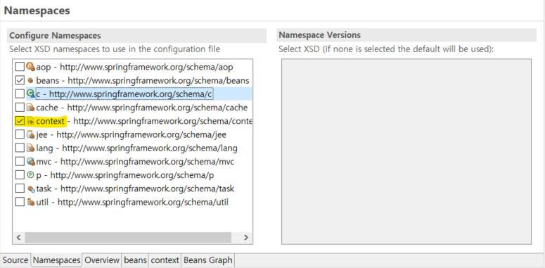

<br>

- <context: component-scan base-package="패키지 경로"> 코드 추가

  ```xml
  <context:component-scan base-package="com.shopping.sample"></context:component-scan>
  ```

  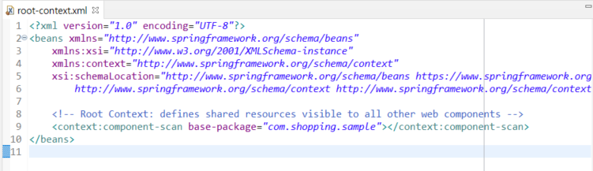

<br>

- Beans Graph를 보면 객체생성에서 생성했던 Chef.java 클래스와 Restaurant.java 클래스가 스프링에서 관리해야 할 객체(Bean)로 인식하고 있는 것을 볼 수 있다.

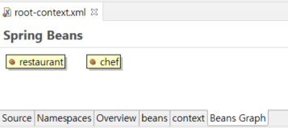


#### 3-2) xml 통해 설정한 객체 테스트

- src/test/java에 com.shopping.sample 패키지 생성 - SampleTests.java 클래스 생성

  ```java
  @RunWith(SpringJUnit4ClassRunner.class)
  @ContextConfiguration("file:src/main/webapp/WEB-INF/spring/root-context.xml")
  @Log4j
  public class SampleTests {
    @Autowired
    private Restaurant restaurant;
   
    @Test
    public void textExist() {
      assertNotNull(restaurant);
   
      log.info(restaurant);
      log.info("--------------------------------------");
      log.info(restaurant.getChef());
    }
  }
  ```

  - 필요한 것들 import 해준다.

  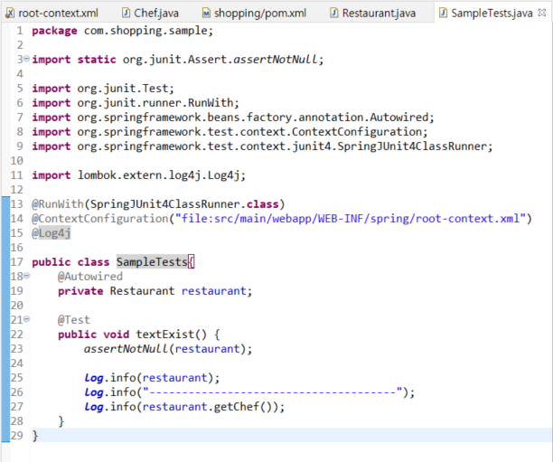

- SampleTest.java - Run As - Junit Test

  - 테스트 성공 결과가 나온다. 

  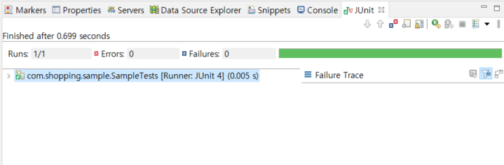

  

  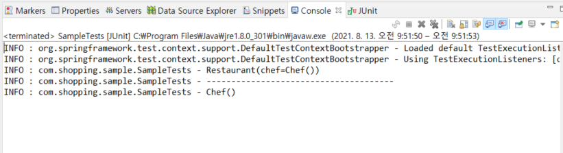


