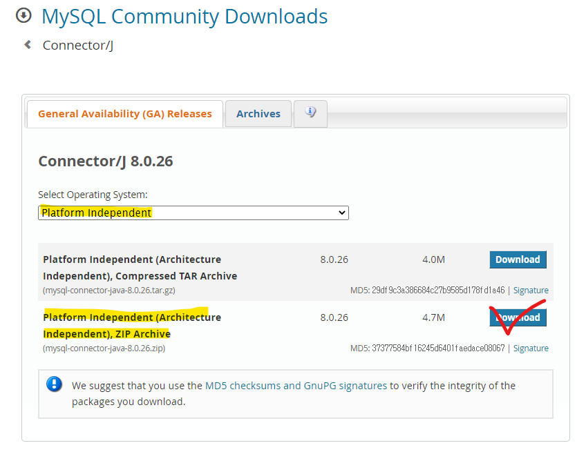
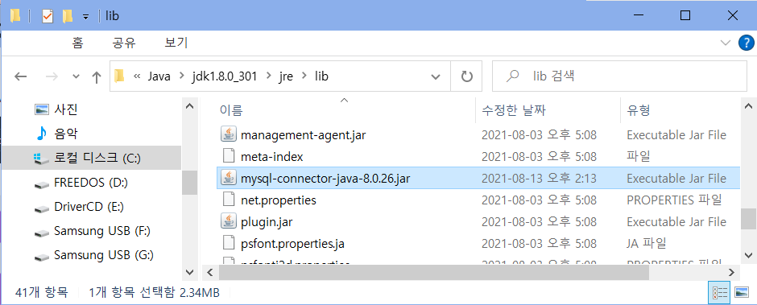
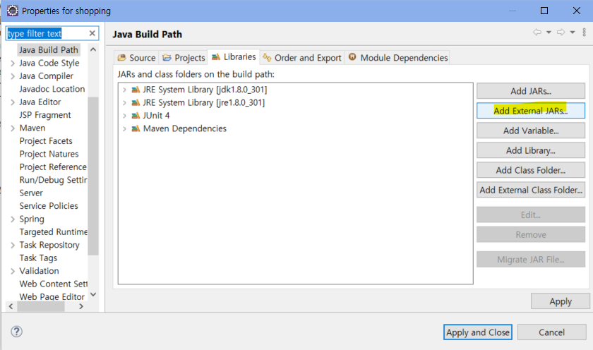
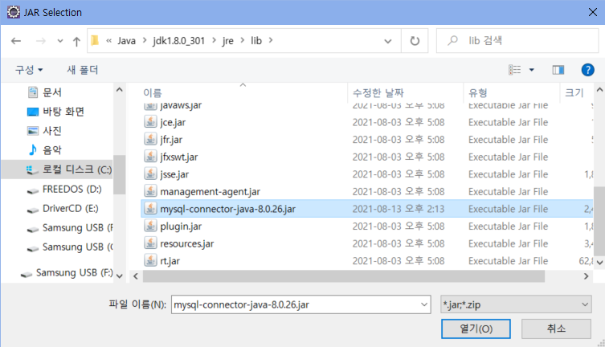
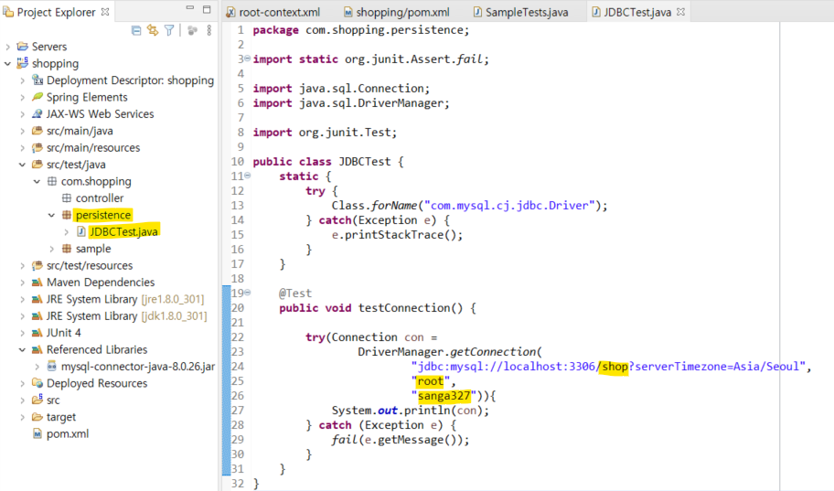
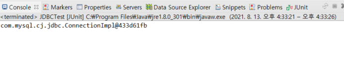
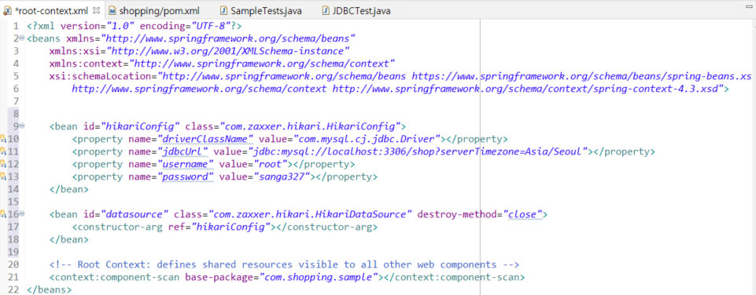
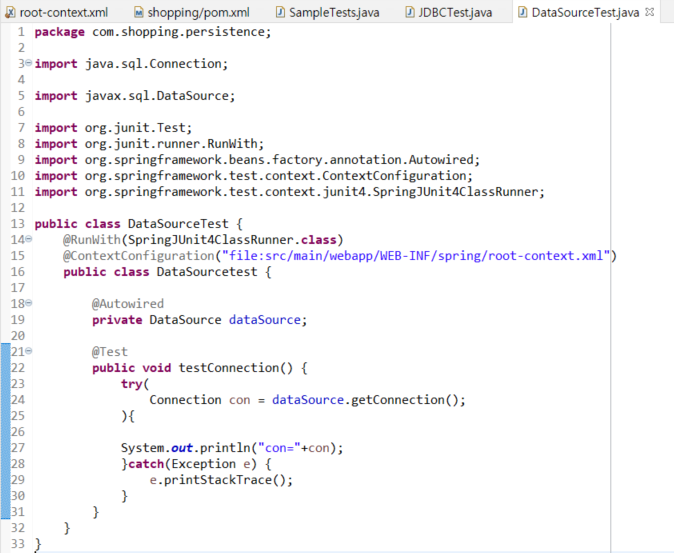

## 0. 프로젝트 생성 및 기본 환경설정 3

> #### JDBC 라이브러리 및 HikariCP 라이브러리 추가
>
> - 목차
>   - MySQL JDBC Driver 설치 및 테스트
>   - HikariCP 라이브러리 추가 및 테스트


### 1) MySQL JDBC Driver 설치

- Maven repository 사이트에서 mysql 을 검색하고 MySQL connector/j를 다운

  - 자신에게 맞는 버전 선택([참고](https://mvnrepository.com/artifact/mysql/mysql-connector-java)) 하여 다운([다운로드](https://dev.mysql.com/downloads/connector/j/))

  

  <br>

  - 압축 해제 후 mysql-connector-java-8.0.26-bin.jar 파일 복사하여 jdk 위치에 복사

  

  <br>

- build path 하여 라이브러리 파일 등록

  

  

<br>

- pom.xml 에 추가

  ```xml
  <dependency>
      <groupId>mysql</groupId>
      <artifactId>mysql-connector-java</artifactId>
      <version>8.0.26</version>
  </dependency>
  ```

  <br>

---


### 2) JDBC 테스트

- JDBC와 데이터베이스가 잘 연결되었는지 확인하기 위한 테스트를 해 보자. 

- src/test/java - com.shopping.persistence 생성 - JDBCTest.java 클래스 생성 - 코드 추가

  ```java
  	static {
  		try {
  			Class.forName("com.mysql.cj.jdbc.Driver");
  		} catch(Exception e) {
  			e.printStackTrace();
  		}
  	}
  	
  	@Test
  	public void testConnection() {
  		
  		try(Connection con = 
  				DriverManager.getConnection(
  						"jdbc:mysql://localhost:3306/데이터베이스(스키마) 이름?serverTimezone=Asia/Seoul",
  						"데이터베이스 사용자명",
  						"사용자 비밀번호")){
  			System.out.println(con);
  		} catch (Exception e) {
  			fail(e.getMessage());
  		}
  	}
  ```

  

  

- 추가한 클래스 Junit 테스트 - Run As - Junit

  - 정상적으로 연결된 것을 알 수 있다. 

  

---

### 3) HikariCP 라이브러리 추가 및 DataSource 설정

커넥션 풀을 사용하기 위해 다음 두 가지 수행

1) pom.xml에 Maven 코드를 추가

2) root-context.xml에 DataSource에 대한 설정

<br>

- HikariCP 라이브러리 추가(Java 버전 8의 경우, 3.4.2 사용)
  - pom.xml

    ```xml
    		<!-- https://mvnrepository.com/artifact/com.zaxxer/HikariCP -->
    		<dependency>
    		    <groupId>com.zaxxer</groupId>
    		    <artifactId>HikariCP</artifactId>
    		    <version>3.4.2</version>
    		</dependency>	
    ```

<br>

- DataSource 설정

  - root-context.xml에 다음 코드 추가

    ```xml
    	<bean id="hikariConfig" class="com.zaxxer.hikari.HikariConfig">
     		<property name="driverClassName" value="com.mysql.cj.jdbc.Driver"></property>
    		<property name="jdbcUrl" value="jdbc:mysql://localhost:3306/데이터베이스명?serverTimezone=Asia/Seoul"></property> 
    		<property name="username" value="사용자명"></property>
    		<property name="password" value="비밀번호"></property>
    	</bean>	
    	
    	<bean id="datasource" class="com.zaxxer.hikari.HikariDataSource" destroy-method="close">
    		<constructor-arg ref="hikariConfig"></constructor-arg>
    	</bean>
    ```

    


---

### 4) 테스트

스프링에 빈(Bean)으로 등록된 DataSource를 이용해서 Connection을 제대로 처리할 수 있는지를 확인하기 위한 용도

- src/test/java - com.shopping.persistence - DataSourceTest.java 생성 후 코드 추가

  ```java
  @RunWith(SpringJUnit4ClassRunner.class)
  @ContextConfiguration("file:src/main/webapp/WEB-INF/spring/root-context.xml")
  public class DataSourcetest {
  
  	@Autowired
  	private DataSource dataSource;
  	
  	@Test
  	public void testConnection() {
  		try(
  			Connection con = dataSource.getConnection();	
  		){
  			
  		System.out.println("con="+con);
  		}catch(Exception e) {
  			e.printStackTrace();
  		}
  	}	
  }
  ```

  

  

- run as - JUnit Test
