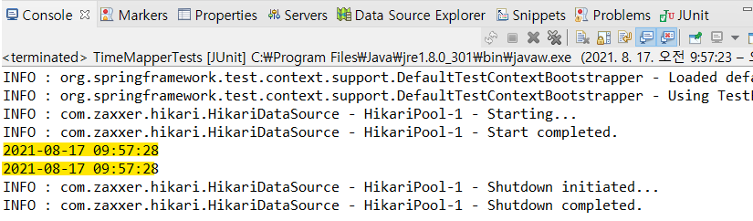

## 0. 프로젝트 생성 및 기본 환경설정 4

> #### My Batis 라이브러리 추가 및 SQLSessionFactory 설정
>
> - 목차
>   - MyBatis 설명
>     - MyBatis 라이브러리 추가
>   - SQLSession 설정 
>     - 테스트
>   - MyBatis 사용
>     - Mapper 인터페이스
>     - Mapper XML

<br>

### 1-1) MyBatis 란?

- 자바 어플리케이션과 데이터베이스를 연동한 프로그래밍을 하기 위해 JDBC 사용
- JDBC 사용의 단점
  - 코드가 복잡
  - 1개의 클래스에 반복되는 코드 존재
  - 하나의 파일에 JAVA 언어와 SQL 언어 함께 존재 - 재사용성이 떨어짐
- MyBatis는 이러한 JDBC의 단점들을 보완하여 데이터베이스 연동 프로그래밍을 더 쉽게 할 수 있도록 돕는 개발 프레임워크

<br>

- MyBatis의 특징
  - SQL 명령어를 자바 코드에서 분리하여 XML 파일에 따로 관리
  - 기존의 SQL을 그대로 사용 가능
  - JDBC의 대안으로 자주 사용

<br>

---

### 1-2) MyBatis 라이브러리 추가

- MyBatis 사용을 위해 `mybatis`, `mybatis-spring`, `spring-jdbc`, `spring-tx` 4개의 라이브러리 필요

  - `mybatis-spring`: 스프링과 mybatis 연동시켜주는 라이브러리
  - `spring-jdbc`: 스프링에서 데이터베이스 처리하는 라이브러리
  - `spring-tx`: 스프링에서 트랜잭션 처리하는 라이브러리

- 아래의 maven 코드를 pom.xml에 추가

  ```xml
  		<!-- https://mvnrepository.com/artifact/org.mybatis/mybatis -->
  		<dependency>
  		    <groupId>org.mybatis</groupId>
  		    <artifactId>mybatis</artifactId>
  		    <version>3.5.3</version>
  		</dependency>
  		<!-- https://mvnrepository.com/artifact/org.mybatis/mybatis-spring -->
  		<dependency>
  		    <groupId>org.mybatis</groupId>
  		    <artifactId>mybatis-spring</artifactId>
  		    <version>2.0.3</version>
  		</dependency>
  		<!-- https://mvnrepository.com/artifact/org.springframework/spring-tx -->
  		<dependency>
  		    <groupId>org.springframework</groupId>
  		    <artifactId>spring-tx</artifactId>
  		    <version>${org.springframework-version}</version>
  		</dependency>
  		<!-- https://mvnrepository.com/artifact/org.springframework/spring-jdbc -->
  		<dependency>
  		    <groupId>org.springframework</groupId>
  		    <artifactId>spring-jdbc</artifactId>
  		    <version>${org.springframework-version}</version>
  		</dependency>
  ```

  

<br>

---

### 2-1) SQLSessionFactory 설정

- SQLSession: 개방에서 Connection을 생성하거나 원하는 SQL을 전달하고, 결과를 return 받도록 해주는 객체
- SQLSessionFactory: SQLSession을 만들어 내는 객체
  - MyBatis-spring 라이브러리의 클래스
  - 스프링에서 SQLSessionFactory 객체를 인식시키기 위해 SqlSessionFactoryBean을 사용

<br>

- root-context.xml에 추가

  ```xml
  	<bean id="sqlSessionFactory" class="org.mybatis.spring.SqlSessionFactoryBean">
  		<property name="dataSource" ref="datasource"></property>
  	</bean>
  ```

  

<br>

---

### 2-2) 테스트 

- SqlSessionFactoryBean을 이용해서 SqlSession을 사용하는 테스트 

- 기존의 DataSourceTest.java 에 테스트할 코드 추가

  - SqlSessionFactory 객체 주입
  - try문에 SqlSession 객체를 인스턴스화 하는 코드와 출력문 코드 추가

  ```java
  @RunWith(SpringJUnit4ClassRunner.class)
  @ContextConfiguration("file:src/main/webapp/WEB-INF/spring/root-context.xml")
  public class DataSourceTest {
  
  	@Autowired
  	private DataSource dataSource;
  	
  	@Autowired
  	private SqlSessionFactory sqlSessionFactory;
  	
  	@Test
  	public void testConnection() {
  		try(
  			Connection con = dataSource.getConnection();
  			SqlSession session = sqlSessionFactory.openSession();
  		){
  			
  		System.out.println("con=" + con);
  		System.out.println("session=" + session);
  			
  		}catch(Exception e) {
  			e.printStackTrace();
  		}
  	}
  }
  ```
  
  

<br>

- Run as - Junit test

  

---

### 3-1) Mapper 인터페이스

- SQLSessionFactory를 이용하여 코드 작성해도 직접 Connection 객체를 얻어 JDBC 코딩이 가능하다. 그러나 더 편하게 작업하기 위해 설정을 분리해주고 자동으로 처리되는 방식을 사용하는 것이 좋다. 이를 실현하기 위해 MyBatis의 Mapper가 필요하다. 
- Mapper는 SQL과 그에 대한 처리를 지정하는 역할 수행
- 스프링에서 MyBatis 사용하는 경우, Mapper를 인터페이스 형태와 XML 형태로 작성할 수 있다. 

- MyBatis-Spring은 Mapper 인터페이스를 이용하여 실제 SQL 처리가 되는 클래스를 자동으로 생성

<br>

---

### 3-2) Mapper 인터페이스 생성 및 설정 방법

-  Mapper로 사용할 패키지 추가
  - src/main/java - com.shopping.mapper 패키지 추가 - 사용할 인터페이스 생성

    

- root-context.xml 설정

  - mapper에 인터페이스 생성해도 스프링은 해당 패키지의 인터페이스를 mapper로 인식하지 않음. root-context.xml에서 추가적인 설정을 하여 패키지에 생성한 인터페이스를 mapper로 인식하도록 해야 함

  - root-context.xml - 하단의 namespaces - mybatis-spring 추가

    

  <br>

  - 하단의 source - 코드 추가

    ```xml
    <mybatis-spring:scan base-package="com.shopping.mapper"/>
    ```

    


<br>

---

### 3-3) 테스트

- com.shopping.mapper - TimeMapper.java 인터페이스 생성

  ```java
  package com.shopping.mapper;
  
  import org.apache.ibatis.annotations.Select;
  
  public interface TimeMapper {
  
  	@Select("SELECT sysdate() FROM dual")
  	public String getTime();
  	
  }
  ```

- SQL문이 작동하는지 테스트를 위해 src/test/java - com.shopping.persistence - TimeMapperTests 클래스 생성

  ```java
  package com.shopping.persistence;
  
  import org.junit.Test;
  import org.junit.runner.RunWith;
  import org.springframework.beans.factory.annotation.Autowired;
  import org.springframework.test.context.ContextConfiguration;
  import org.springframework.test.context.junit4.SpringJUnit4ClassRunner;
  
  import com.shopping.mapper.TimeMapper;
  
  @RunWith(SpringJUnit4ClassRunner.class)
  @ContextConfiguration("file:src/main/webapp/WEB-INF/spring/root-context.xml")
  public class TimeMapperTests {
  
  	@Autowired
  	private TimeMapper timeMapper;
  	
  	@Test
  	public void testGetTime() {
  		System.out.println(timeMapper.getTime());
  	}	
  }
  ```

- Run As - Junit Test

  

  Mapper에서 작성한 SQL문이 정상 작동한 것을 알 수 있다.

<br>

---

### 4-1) Mapper XML

- Mapper 인터페이스만으로도 SQL을 편라하게 처리 가능
- 복잡하고 길어지는 SQL문을 이용하는 경우, XML 사용
- MyBatis-Spring 라이브러리는 Mapper 인터페이스와 XML 동시에 이용 가능

<br>

---

### 4-2) Mapper XML 생성 및 설정

- XML 저장 위치 (2가지 방법)
  - 1.Mapper 인터페이스가 저장된 곳에 xml 파일 저장
  - 2.src/main/resources - Mapper 인터페이스가 저장된 패키지명을 폴더 경로로 만들어주기
- XML 파일명
  - 규칙은 없으나, 가능하면 Mapper 인터페이스와 동일한 파일명 사용

<br>

- src/main/resources - com.shopping.mapper 폴더 생성 - TimeMapper.xml 파일 생성

  ```xml
  <?xml version="1.0" encoding="UTF-8"?>
  <!DOCTYPE mapper
    PUBLIC "-//mybatis.org//DTD Mapper 3.0//EN"
    "http://mybatis.org/dtd/mybatis-3-mapper.dtd">
    <mapper namespace="com.shopping.mapper.TimeMapper">
      
    </mapper>
  ```

  

<br>

---

### 4-3) 테스트

- 기존에 사용했던 TimeMapper 인터페이스에서 추가적인 메서드를 선언하여 사용

- TimeMapper.java - getTime2() 메서드 추가

  ```java
  	public String getTime2();
  ```

  

<br>

- TimeMapper.xml 파일에 내용 추가

  - < select > 태그 작성 후 실행하고자 하는 SQL문 추가

  - < mapper > 태그에 id속성은 Mapper 인터페이스에 추가한 메서드명과 동일하게 작성

  - < mapper > 태그에 resultType속성은 연동시킬 메서드에 명시된 반환 타입을 작성해줌

  - < mapper > 태그 내부에 SQL문 작성 

    ```xml
      	<select id="getTime2" resultType="string" >
      		SELECT sysdate() FROM dual
      	</select>
    ```

    

<br>

- TimeMapperTests.java에 테스트를 위한 코드 추가

  ```java
  	@Test
  	public void testGetTime2() {
  		System.out.println(timeMapper.getTime2());
  	}
  ```

  

<br>

- Run As - Junit Test

  

  testGetTime, testGetTime2 결과 두 개 다 나온 것을 알 수 있다.

<br>

---

- 길고 복잡한 SQL문을 사용할 때는 XML을 사용하는 두 번째 방법을 사용해야 한다.
- xml 방식을 사용할 때는 namespace 속성을 주의해야 한다. 

