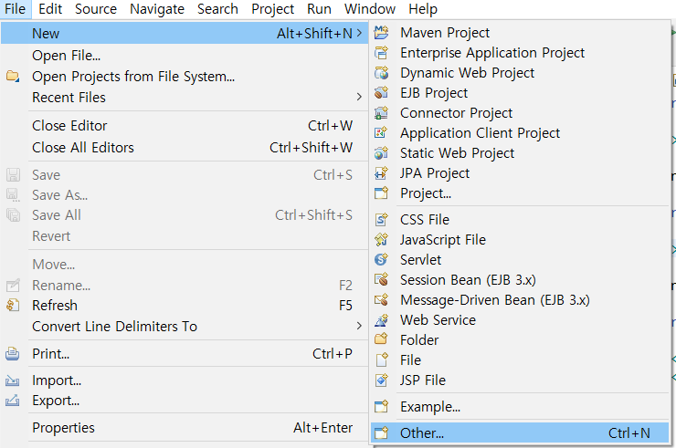
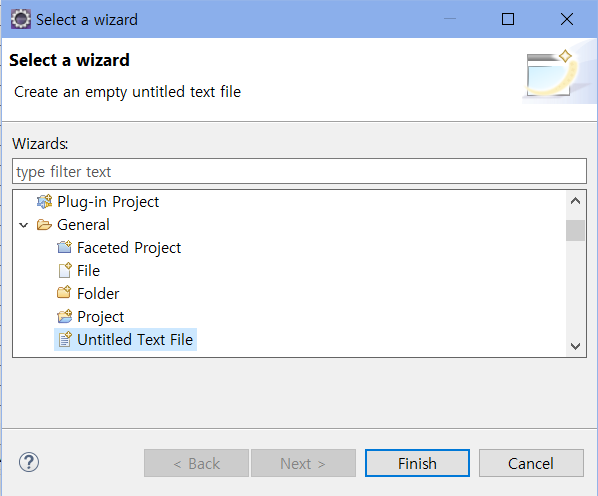
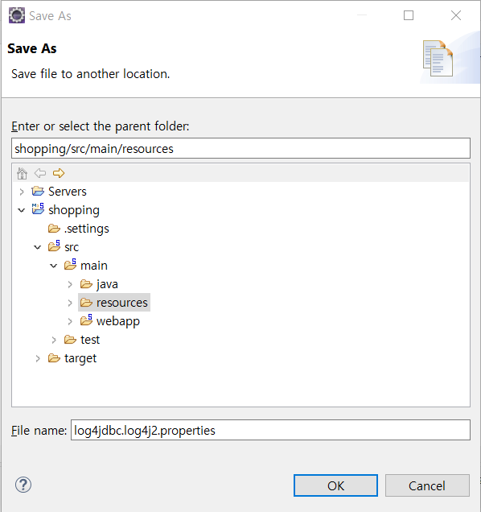
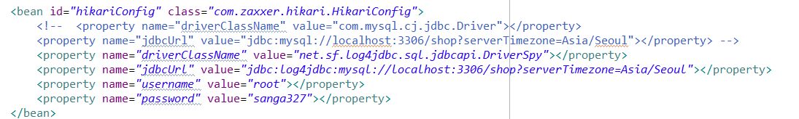
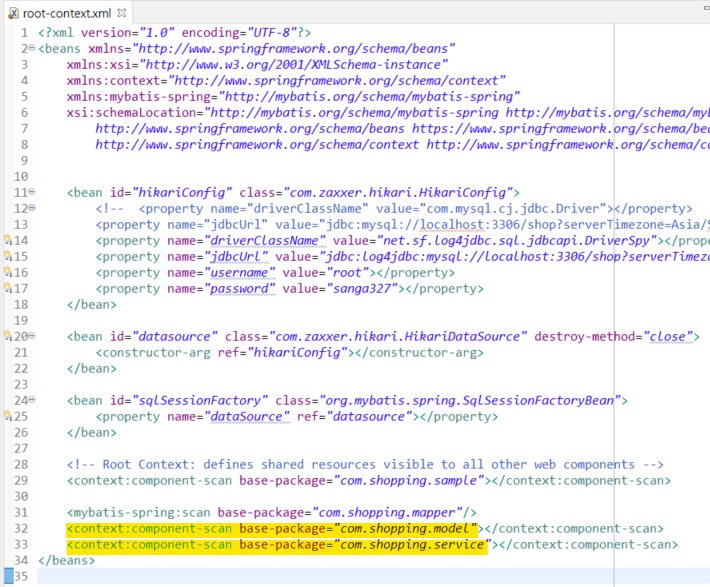
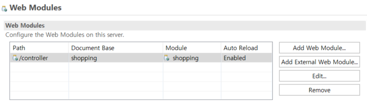
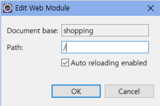

## 0. 프로젝트 생성 및 기본 환경설정 5

> #### Log4jdbc-log4j2 설정 및 패키지 설정
>
> - 목차
>   - Log4jdbc-log4j2 설명
>   - Log4jdbc-log4j2 추가 및 설정
>     - 라이브러리 추가
>     - 로그 설정 파일 추가
>     - JDBC의 연결 정보 설정
>   - 패키지 추가 및 설정
>   - Servlet 버전 변경
>   - 프로젝트가 절대경로 이용하도록 구조 변경

<br>

### 1) Log4jdbc-log4j2란?

- 스프링에서 SQL문을 실행한 로그를 효과적이고 직관적으로 볼 수 있도록 하는 라이브러리

- 테이블이 많은 정보를 가질수록 가독성에 큰 차이가 있음

<br>

---

### 2) Log4jdbc-log4j2 추가 및 설정 방법

jdbc를 사용하기 위해서는 라이브러리 추가, 로그 설정 파일 추가, JDBC 연결 정보 설정이 필요하다.

<br>

#### (1) 라이브러리 추가

- maven 코드를 pom.xml에 추가

  ```xml
  <!-- https://mvnrepository.com/artifact/org.bgee.log4jdbc-log4j2/log4jdbc-log4j2-jdbc4 -->
  <dependency>
      <groupId>org.bgee.log4jdbc-log4j2</groupId>
      <artifactId>log4jdbc-log4j2-jdbc4</artifactId>
      <version>1.16</version>
  </dependency>
  ```

<br>

#### (2) 로그 설정 파일 추가

- src/main/resources - log4jdbc.log4j2.properties 파일 생성 후 코드 추가

  ```properties
  log4jdbc.spylogdelegator.name=net.sf.log4jdbc.log.slf4j.Slf4jSpyLogDelegator
  ```

  - 파일 생성 방법

  - file - new - other

    

  - untitled text file 선택

    

  - 입력 후 저장하여 경로 지정

    

<br>

#### (3) JDBC 연결 정보 설정

- root-context.xml에서 기존 JDBC 드라이버와 URL 정보를 수정해주어야 한다. 기존에 있던 JDBC 드라이버, URL 정보는 삭제 혹은 주석처리한다. 

  ```xml
  	<bean id="hikariConfig" class="com.zaxxer.hikari.HikariConfig">	
  		<property name="driverClassName" value="net.sf.log4jdbc.sql.jdbcapi.DriverSpy"></property>
  		<property name="jdbcUrl" value="jdbc:log4jdbc:mysql://localhost:3306/shop?serverTimezone=Asia/Seoul"></property>
  		<property name="username" value="root"></property>
  		<property name="password" value="sanga327"></property>
  	</bean>
  ```

  

<br>

---

### 3) 패키지 추가 및 설정

- src/main/java 패키지 추가

  - com.shopping.model: VO 패키지. 데이터 타입 저장
  - com.shopping.mapper: DAO 패키지. 데이터베이스 접속하는 역할
  - com.shopping.service: Service 패키지. mapper와 controller 사이 연결 역할

- Mapper XML 저장 위치 폴더 생성

  - src/main/resources - com.shopping.mapper 에 mapper로 사용할 xml 파일 저장

- 생성한 패키지가 스프링에서 인식되도록 root-context.xml 파일 수정

  ```xml
  <mybatis-spring:scan base-package="com.shopping.mapper/">
  <context:component-scan base-package="com.shopping.model"></context:component-scan>
  <context:component-scan base-package="com.shopping.service"></context:component-scan>
  ```

  

<br>

----

### 4) Servlet 버전 변경

- Java 설정 등을 이용하기 위해 Servlet 버전 3.0 이상을 사용해야 함

- pom.xml에서 기존 Servlet 2.5버전을 주석처리 혹은 삭제 후 3.1.0버전 추가

  ```xml
  		<!--<dependency>
  			<groupId>javax.servlet</groupId>
  			<artifactId>servlet-api</artifactId>
  			<version>2.5</version>
  			<scope>provided</scope>
  		</dependency>-->
  
  		<dependency>
  			<groupId>javax.servlet</groupId>
  			<artifactId>javax.servlet-api</artifactId>
  			<version>3.1.0</version>
  			<scope>provided</scope>
  		</dependency>
  ```

  <br>

---

### 5) 프로젝트가 절대경로를 이용하도록 구조 변경 

- Servers - Tomcat v8.5 - Modules 

  - 변경할 controller 선택 후 [Edit] 클릭

    

  - `/controller` -> `/` 로 변경

    

  - ctrl+s 로 저장


