## 1. 페이지 생성 - 메인, 로그인, 회원가입

> - 목차
>   - 메인 페이지 제작
>   - 메인 페이지 Controller 설정
>   - 로그인, 회원가입 페이지
>   - 로그인, 회원가입 페이지 Controller 설정

<br>

### 1) 메인 페이지 생성

- 메인 페이지 UI

  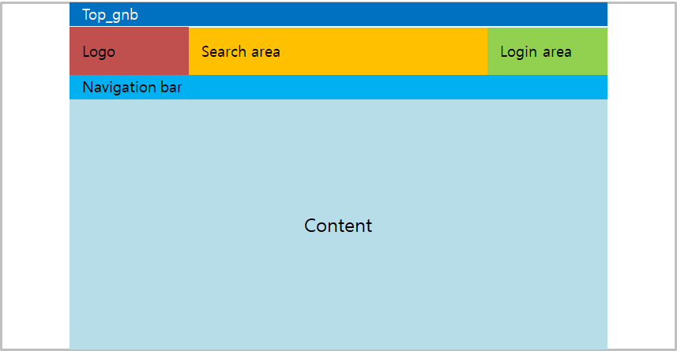

<br>

#### - Login area 개발

- 메인 페이지 생성

  - src/main/webapp/WEB-INF/view - main.jsp

    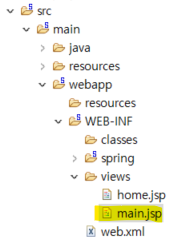

  <br>

- css와 jsp 파일 분리하여 설계하기 위해 src/main/webapp/resources/css - main.css 생성

  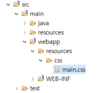

<br>

- main.jsp에 css 파일과 연결하는 태그 추가

  ```html
  <link rel="stylesheet" href="resources/css/main.css">
  ```

  ​	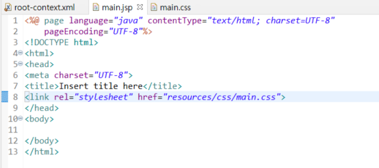

<br>

- main.jsp와 main.css에 아래 코드 추가

  <details>
  <summary> main.jsp 코드 보기</summary>
  <div markdown="1">

  ```jsp
  <%@ page language="java" contentType="text/html; charset=UTF-8"
      pageEncoding="UTF-8"%>
  <!DOCTYPE html>
  <html>
  <head>
  <meta charset="UTF-8">
  <title>Welcome BookMall</title>
  <link rel="stylesheet" href="resources/css/main.css">
  </head>
  <body>
  
  <div class="wrapper">
  	<div class="wrap">
  		<div class="top_gnb_area">
  			<h1>gnb area</h1>
  		</div>
  		<div class="top_area">
  			<div class="logo_area">
  				<h1>logo area</h1>
  			</div>
  			<div class="search_area">
  				<h1>Search area</h1>
  			</div>
  			<div class="login_area">
  				<div class="login_button"><a href="/member/login">로그인</a></div>
  				<span><a href="/member/join">회원가입</a></span>
  			</div>
  			<div class="clearfix"></div>			
  		</div>
  		<div class="navi_bar_area">
  			<h1>navi area</h1>
  		</div>
  		<div class="content_area">
  			<h1>content area</h1>
  		</div>
  	</div>
  </div>
  
  </body>
  </html>
  ```

  </div></details>

  <details>
  <summary> main.css 코드 보기</summary>
  <div markdown="1">

  ```css
  @charset "UTF-8";
  *{
  	margin: 0;
  	padding:0;
  }
  /* 화면 전체 렙 */
  .wrapper{
  	width: 1900px;
  }
  /* content 랩 */
  .wrap{
  	width : 1080px;
  	margin: auto;
  }
  /* 홈페이지 기능 네비 */ 
  .top_gnb_area{
  	width: 100%;
      height: 50px;
      background-color: #a2a2ea;
  }
  /* 로고, 검색, 로그인 */
  .top_area{
  	width: 100%;
      height: 150px;
      /* background-color: #f7f0b9; */
  }
  /* 로고 영역 */
  .logo_area{
  	width: 25%;
  	height: 100%;
  	background-color: red;
  	float:left;
  }
  /* 검색 박스 영역 */
  .search_area{
  	width: 50%;
  	height: 100%;
  	background-color: yellow;
  	float:left;	
  }
  /* 로그인 버튼 영역 */
  .login_area{
  	width: 25%;
  	height: 100%;
  	display: inline-block;	
  	text-align: center;		
  }
  .login_button{
  	height: 50%;
      background-color: #D4DFE6;
      margin-top: 30px;
      line-height: 77px;
      font-size: 40px;
      font-weight: 900;
      border-radius: 10px;
      cursor: pointer;	
  }
  .login_area>span{
  	margin-top: 10px;
      font-weight: 900;
      display: inline-block;
  }
  .login_button{
  	height : 50%;
  	background-color: #D4DFE6;
  	margin-top:30px;
  }
  
  /* 제품 목록 네비 */
  .navi_bar_area{
  	width: 100%;
      height: 70px;
      background-color: #7696fd;
  }
  
  /* 홈페이지 메인 제품 목록  */
  .content_area{
  	width: 100%;
      background-color: #97ef97;
      height: 1000px;
  }
  
  /* float 속성 해제 */
  .clearfix{
  	clear: both;
  }
  ```

  </div></details>

<br>

---

### 2) 메인 페이지 Controller 설정

- src/main/java - com.shopping.controller - BookController.java 클래스 생성
  - 페이지에서 기본적인 기능들(메인페이지 이동, 상품 검색 등)의 요청을 관리

- `@Controller` 어노테이션 추가

  - 이 클래스가 controller 역할을 한다는 것을 스프링에 선언하는 역할

  ```java
  private static final Logger logger = LoggerFactory.getLogger("BookController".class);
  ```

  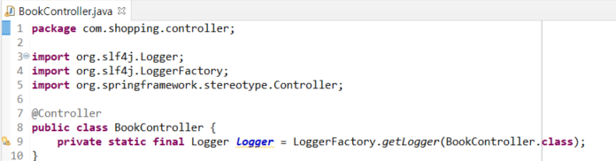

<br>

- mainPageGET() 메서드 추가

  - main.jsp에 접속이 가능하도록 함

    ```java
    	//메인 페이지 이동
    	@RequestMapping(value = "/main", method = RequestMethod.GET)
    	public void mainPageGET() {
    		logger.info("메인 페이지 진입");
    	}
    ```

    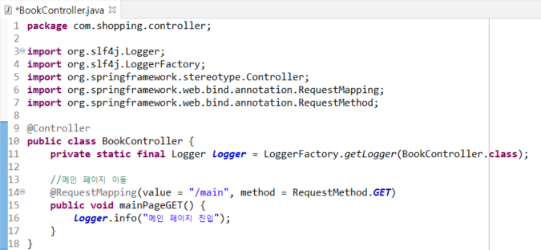

<br>

- Run As - Run on Server 해서 main페이지 확인해보자. 

  - http://localhost:8080/main 페이지 확인

    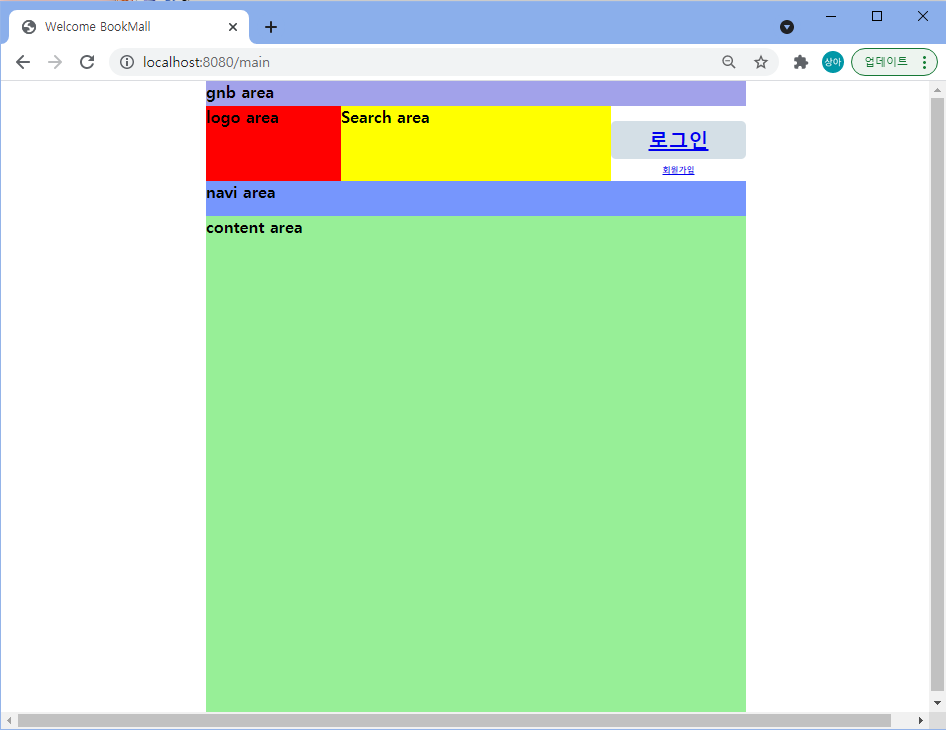

<br>

---

### 3) 로그인, 회원가입 페이지 생성

- src/main/webapp/WEB-INF/views - member 폴더 추가 
  - `login.jsp`, `join.jsp` 생성
- src/main/webapp/resources/css - member 폴더 추가
  - `login.css`, `join.css` 생성

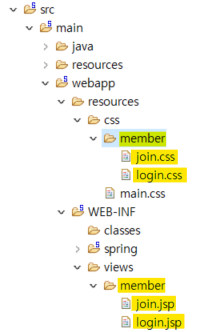


<details>
<summary> login.jsp 코드 보기</summary>
<div markdown="1">

```jsp
<%@ page language="java" contentType="text/html; charset=UTF-8"
    pageEncoding="UTF-8"%>
<!DOCTYPE html>
<html>
<head>
<meta charset="UTF-8">
<title>Insert title here</title>
<link rel="stylesheet" href="/resources/css/member/login.css">
</head>
<body>

<div class="wrapper">
	<div class="wrap">
		<div class="logo_wrap">
			<span>Book Mall</span>
		</div>
		<div class="login_wrap"> 
			<div class="id_wrap">
					<div class="id_input_box">
					<input class="id_input">
				</div>
			</div>
			<div class="pw_wrap">
				<div class="pw_input_box">
					<input class="pw_iput">
				</div>
			</div>
			<div class="login_button_wrap">
				<input type="button" class="login_button" value="로그인">
			</div>			
		</div>
	</div>
</div>

</body>
</html>
```

</div></details>


<details>
<summary> login.css 코드 보기</summary>
<div markdown="1">

```css
@charset "UTF-8";
*{
	margin: 0;
	padding:0;
}

/* 화면 전체 렙 */
.wrapper{
	width: 1900px;	
}

/* content 랩 */
.wrap{
	width : 800px;
	margin: auto;
}

/* 페이지 로고 */
.logo_wrap{
	text-align: center;	
	margin: 150px 0;	
}
.logo_wrap>span{
	font-size : 50px;
	font-weight: 900;
}


/* 로그인 area */
.id_input_box{
	border: 1px solid black;
	height:31px;
	padding: 10px 14px;	
	display: block;
	width : 80%;
	margin : auto;	
}
.id_input{
	width:100%;
	height:100%;
	border:none;
	font-size:28px;
}


.pw_wrap{
	margin-top: 40px;
}
.pw_input_box{
	border: 1px solid black;
	height:31px;
	padding: 10px 14px;	
	display: block;
	width : 80%;
	margin : auto;	
}
.pw_iput{
	width:100%;
	height:100%;
	border:none;
	font-size:28px;
}


.login_button_wrap{
	margin-top: 40px;
	text-align: center;
}
.login_button{
	width: 84%;
    height: 80px;
    background-color: #6AAFE6;
    font-size: 40px;
    font-weight: 900;
    color: white;
    margin : auto;
}

/* float 속성 해제 */
.clearfix{
	clear: both;
}

```

</div></details>


<details>
<summary> join.jsp 코드 보기</summary>
<div markdown="1">

```jsp
<%@ page language="java" contentType="text/html; charset=UTF-8"
    pageEncoding="UTF-8"%>
<!DOCTYPE html>
<html>
<head>
<meta charset="UTF-8">
<title>Insert title here</title>
<link rel="stylesheet" href="/resources/css/member/join.css">
</head>
<body>

<div class="wrapper">
	<form action="">
	<div class="wrap">
			<div class="subjecet">
				<span>회원가입</span>
			</div>
			<div class="id_wrap">
				<div class="id_name">아이디</div>
				<div class="id_input_box">
					<input class="id_input">
				</div>
			</div>
			<div class="pw_wrap">
				<div class="pw_name">비밀번호</div>
				<div class="pw_input_box">
					<input class="pw_input">
				</div>
			</div>
			<div class="pwck_wrap">
				<div class="pwck_name">비밀번호 확인</div>
				<div class="pwck_input_box">
					<input class="pwck_input">
				</div>
			</div>
			<div class="user_wrap">
				<div class="user_name">이름</div>
				<div class="user_input_box">
					<input class="user_input">
				</div>
			</div>
			<div class="mail_wrap">
				<div class="mail_name">이메일</div> 
				<div class="mail_input_box">
					<input class="mail_input">
				</div>
				<div class="mail_check_wrap">
					<div class="mail_check_input_box">
						<input class="mail_check_input">
					</div>
					<div class="mail_check_button">
						<span>인증번호 전송</span>
					</div>
					<div class="clearfix"></div>
				</div>
			</div>
			<div class="address_wrap">
				<div class="address_name">주소</div>
				<div class="address_input_1_wrap">
					<div class="address_input_1_box">
						<input class="address_input_1">
					</div>
					<div class="address_button">
						<span>주소 찾기</span>
					</div>
					<div class="clearfix"></div>
				</div>
				<div class ="address_input_2_wrap">
					<div class="address_input_2_box">
						<input class="address_input_2">
					</div>
				</div>
				<div class ="address_input_3_wrap">
					<div class="address_input_3_box">
						<input class="address_input_3">
					</div>
				</div>
			</div>
			<div class="join_button_wrap">
				<input type="button" class="join_button" value="가입하기">
			</div>
		</div>
	</form>
</div>

</body>
</html>
```

</div></details>


<details>
<summary> join.css 코드 보기</summary>
<div markdown="1">

```css
@charset "UTF-8";
*{
	margin: 0;
	padding:0;
}

/* 화면 전체 렙 */
.wrapper{
	width: 1900px;	
}

/* content 랩 */
.wrap{
	width : 800px;
	margin: auto;
}
/* 페이지 제목 */
.subjecet{
	width: 100%;
    height: 120px;
    background-color: #8EC0E4;
}
.subjecet span{
	margin-left: 31px;
    font-size: 80px;
    font-weight: 900;
    color: white;
}

/* 아이디 영역 */
.id_wrap{
	width: 100%;
    margin-top: 20px;
}
.id_name{
	font-size: 25px;
    font-weight: bold;
}
.id_input_box{
	border: 1px solid black;
	height:31px;
	padding: 10px 14px;	
	
}
.id_input{
	width:100%;
	height:100%;
	border:none;
	font-size:28px;
}

/* 비밀번호 영역 */
.pw_wrap{
	width: 100%;
    margin-top: 20px;
}
.pw_name{
	font-size: 25px;
    font-weight: bold;
}
.pw_input_box{
	border: 1px solid black;
	height:31px;
	padding: 10px 14px;	
	
}
.pw_input{
	width:100%;
	height:100%;
	border:none;
	font-size:28px;
}

/* 비밀번호 확인 영역 */
.pwck_wrap{
	width: 100%;
    margin-top: 20px;
}
.pwck_name{
	font-size: 25px;
    font-weight: bold;
}
.pwck_input_box{
	border: 1px solid black;
	height:31px;
	padding: 10px 14px;	
	
}
.pwck_input{
	width:100%;
	height:100%;
	border:none;
	font-size:28px;
}

/* 이름 영역 */
.user_wrap{
	width: 100%;
    margin-top: 20px;
}
.user_name{
	font-size: 25px;
    font-weight: bold;
}
.user_input_box{
	border: 1px solid black;
	height:31px;
	padding: 10px 14px;	
	
}
.user_input{
	width:100%;
	height:100%;
	border:none;
	font-size:28px;
}

/* 메일 영역 */
.mail_wrap{
	width: 100%;
    margin-top: 20px;
}
.mail_name{
	font-size: 25px;
    font-weight: bold;
}
.mail_input_box{
	border: 1px solid black;
	height:31px;
	padding: 10px 14px;	
	
}
.mail_input{
	width:100%;
	height:100%;
	border:none;
	font-size:28px;
}
.mail_check_wrap{
	margin-top: 20px;	
}
.mail_check_input_box{
	border: 1px solid black;
    height: 31px;
    padding: 10px 14px;
    width: 61%;
    float: left;
}
.mail_check_input{
	width:100%;
	height:100%;
	border:none;
	font-size:28px;
}
.mail_check_button{
    border: 1px solid black;
    height: 51px;
    width: 30%;
    float: right;
    line-height: 50px;
    text-align: center;
    font-size: 30px;
    font-weight: 900;
    background-color: #ececf7;
    cursor: pointer;
}

/* 주소 영역 */
.address_wrap{
	width: 100%;
    margin-top: 20px;
}
.address_name{
	font-size: 25px;
    font-weight: bold;
}
.address_input_1_box{
	border: 1px solid black;
    height: 31px;
    padding: 10px 14px;
    width: 61%;
    float: left;	
}
.address_input_1{
	width:100%;
	height:100%;
	border:none;
	font-size:28px;	
}
.address_button{
    border: 1px solid black;
    height: 51px;
    width: 30%;
    float: right;
    line-height: 50px;
    text-align: center;
    font-size: 30px;
    font-weight: 900;
    background-color: #ececf7;
    cursor: pointer;	
}
.address_input_2_wrap{
	margin-top: 20px;
}
.address_input_2_box{
	border: 1px solid black;
	height:31px;
	padding: 10px 14px;	
	
}
.address_input_2{
	width:100%;
	height:100%;
	border:none;
	font-size:28px;
}

.address_input_3_wrap{
	margin-top: 20px;
}
.address_input_3_box{
	border: 1px solid black;
	height:31px;
	padding: 10px 14px;	
	
}
.address_input_3{
	width:100%;
	height:100%;
	border:none;
	font-size:28px;
}

/* 가입하기 버튼 */
.join_button_wrap{
	margin-top: 40px;
	text-align: center;
}
.join_button{
	width: 100%;
    height: 80px;
    background-color: #6AAFE6;
    font-size: 40px;
    font-weight: 900;
    color: white;
}

/* float 속성 해제 */
.clearfix{
	clear: both;
}
```

</div></details>

<br>

---

### 4) 로그인, 회원가입 페이지 Controller 설정

- src/main/java - com.shopping.controller - MemberController.java 생성

  - `@Controller`, `@RequestMappint` 어노테이션 

  - 로그인, 회원가입 페이지를 호출하는 메서드(loginGET, joinGET) 추가

    ```java
    	//회원가입 페이지 이동
    	@RequestMapping(value = "join", method = RequestMethod.GET)
    	public void loginGET() {
    		logger.info("회원가입 페이지 진입");	
    	}
    	
    	//로그인 페이지 이동
    	@RequestMapping(value = "login", method = RequestMethod.GET)
    	public void joinGET() {
    		logger.info("로그인 페이지 진입");
    	}
    ```

    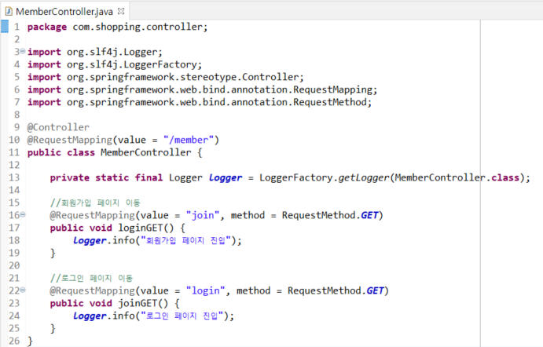

<br>

- Run As - Run on Server 

  - 로그인 화면

    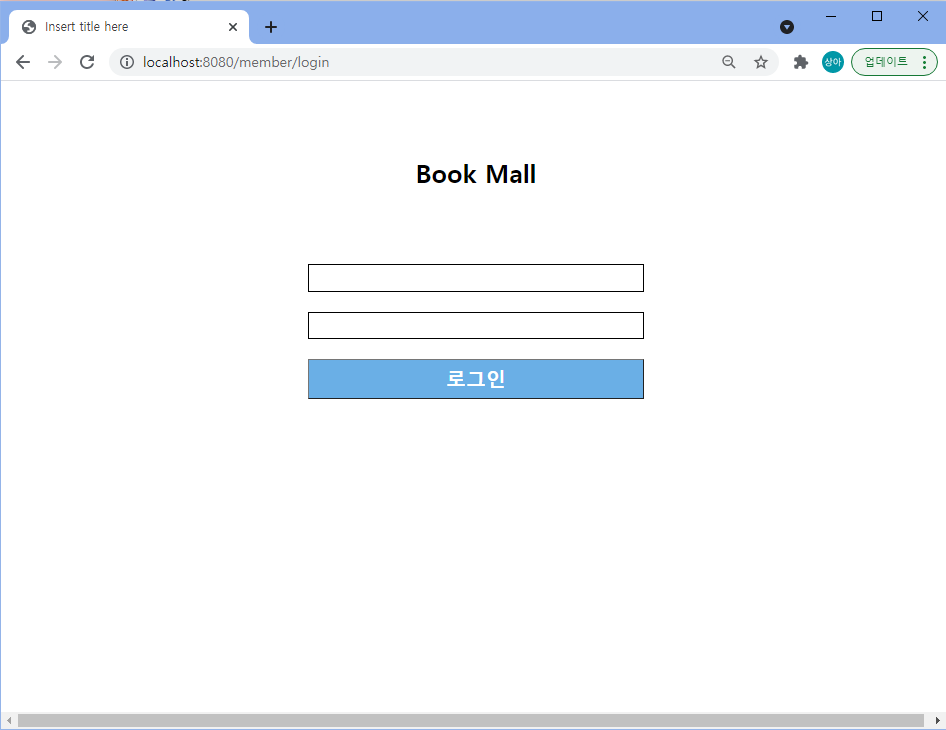

  <br>

  - 회원가입

    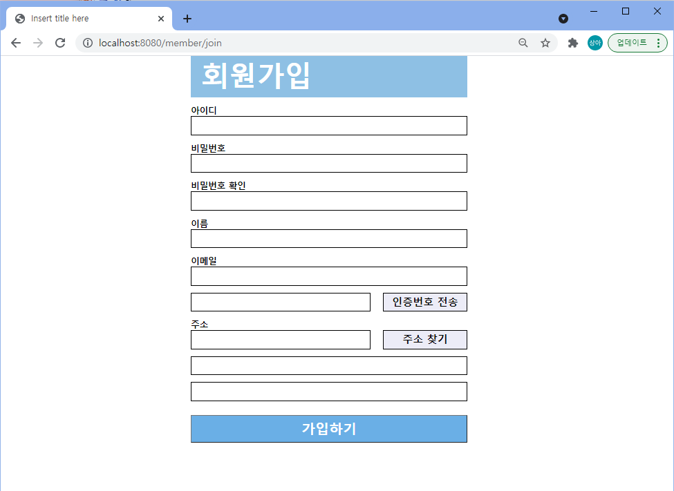

