## 2. 회원가입 기능 구현

> - 목차 
>
>   1. 데이터베이스 테이블 생성 및 VO 생성
>   2. MemberMapper.xml
>      - insert 쿼리문 테스트 및 관리자 아이디 생성
>      - mapper.xml 작성
>
>   3. MemberMapper.java 인터페이스 추가
>   4. Mapper에 추가한 쿼리문 테스트(MemberMapperTests.java)
>   5. MemberService.java 추가
>   6. MemberController.java 회원가입 메서드 추가
>   7. join.jsp

<br>

### 1) 데이터베이스 테이블 생성 및 VO 생성

- 회원가입 기능 구현을 위해 회원 테이블과 회원 테이블의 VO 생성
  - 회원 테이블: book_member
  - VO: MemberVO

- 테이블 생성

  ```sql
  CREATE TABLE BOOK_MEMBER(  
  	memberId VARCHAR(50) PRIMARY KEY,  
  	memberPw VARCHAR(100) NOT NULL,  
  	memberName VARCHAR(30) NOT NULL,  
  	memberMail VARCHAR(100) NOT NULL,  
  	memberAddr1 VARCHAR(100) NOT NULL, 
  	memberAddr2 VARCHAR(100) NOT NULL,  
  	memberAddr3 VARCHAR(100) NOT NULL,  
  	adminCk int NOT NULL,  
  	regDate DATE NOT NULL,  
  	money int NOT NULL,  
  	point int NOT NULL
  );
  ```

  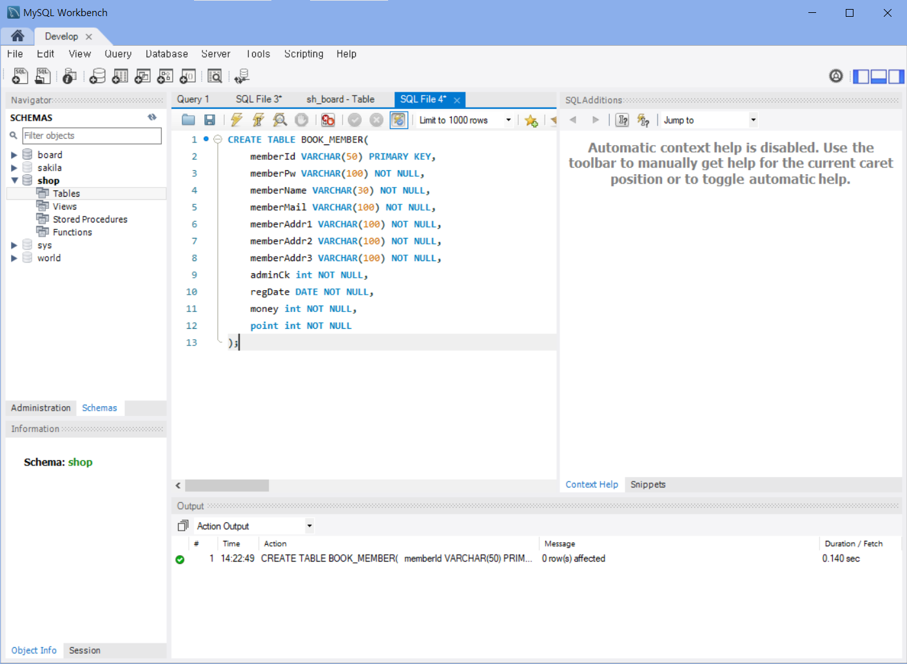

<br>

- VO 생성

  - com.shopping.model - MemeberVO.java 생성

    ```java
    package com.shopping.model;
    
    public class MemberVO {
    	//회원 id
    	private String memberId;
    	
    	//회원 비밀번호
    	private String memberPw;
    	
    	//회원 이름
    	private String memberName;
    	
    	//회원 이메일
    	private String memberMail;
    	
    	//회원 우편번호
    	private String memberAddr1;
    	
    	//회원 주소
    	private String memberAddr2;
    	
    	//회원 상세주소
    	private String memberAddr3;
    	
    	// 관리자 구분(0:일반사용자, 1:관리자)
    	private int adminCk;
    	
    	//등록일자
    	private int regDate;
    	
    	//회원 돈
    	private int money;
    	
    	//회원 포인트
    	private int point;
    }
    ```

  <br>

  - Getter, Setter, toString

    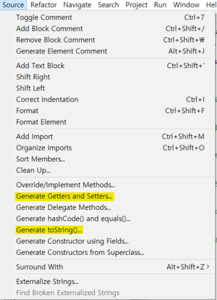

    - toString

    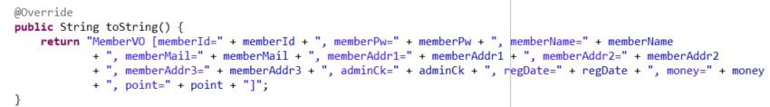

<br>

---

### 2) MemberMapper.xml 추가

#### (1) insert 쿼리문 테스트 및 관리자 아이디 만들기

- MemberMapper.xml에 회원가입 쿼리문 작성에 앞서 회원가입에 사용할 쿼리 테스트

  ```sql
  -- 회원가입 쿼리
  insert into book_member values('admin', 'admin', 'admin', 'admin', 'admin', 'admin', 'admin', 1, sysdate(), 1000000, 1000000);
  
  -- 정보 확인
  select * from book_member;
  ```

  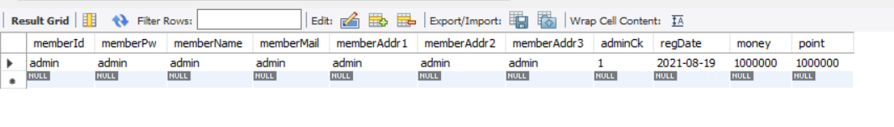

  <br>

#### (2) mapper.xml 작성

- src/main/resources - com.shopping.mapper - MemberMapper.xml 생성

  ```xml
  <?xml version="1.0" encoding="UTF-8"?>
  <!DOCTYPE mapper
    PUBLIC "-//mybatis.org//DTD Mapper 3.0//EN"
    "http://mybatis.org/dtd/mybatis-3-mapper.dtd">
    <mapper namespace="com.shopping.mapper.MemberMapper">
      <insert id="memberJoin">
        insert into book_member values(#{memberId}, #{memberPw}, #{memberName}, #{memberMail}, #{memberAddr1}, #{memberAddr2}, #{memberAddr3}, 0, sysdate(), 100000, 5000 )
    	</insert>
    </mapper>
  ```

<br>

---

### 3) MemberMapper 인터페이스 추가

- src/main/java - com.shopping.mapper - MemberMapper.java 인터페이스 추가

  - 회원가입 insert 쿼리를 실행시켜줄 메서드 작성

    ```java
    	//회원가입
    	public void memberJoin(MemberVO member);
    ```

    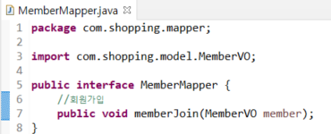

<br>

---

### 4) Mapper에 추가한 쿼리문 테스트 

- src/test/java - com.shopping.mapper - MemberMapperTests.java 클래스 추가

- MemberMapperTests.java

  <details>
  <summary> MemberMapperTests.java 코드 보기</summary>
  <div markdown="1">

  ```java
  package com.shopping.mapper;
  
  import org.junit.Test;
  import org.junit.runner.RunWith;
  import org.springframework.beans.factory.annotation.Autowired;
  import org.springframework.test.context.ContextConfiguration;
  import org.springframework.test.context.junit4.SpringJUnit4ClassRunner;
  
  import com.shopping.model.MemberVO;
  
  @RunWith(SpringJUnit4ClassRunner.class)
  @ContextConfiguration("file:src/main/webapp/WEB-INF/spring/root-context.xml")
  public class MemberMapperTests {
  
  	@Autowired
  	private MemberMapper membermapper;			//MemberMapper.java 인터페이스 의존성 주입
  	
  	//회원가입 쿼리 테스트 메서드
  	@Test
  	public void memberJoin() throws Exception{
  		MemberVO member = new MemberVO();
  		
  		member.setMemberId("test");			//회원 id
  		member.setMemberPw("test");			//회원 비밀번호
  		member.setMemberName("test");		//회원 이름
  		member.setMemberMail("test");		//회원 메일
  		member.setMemberAddr1("test");		//회원 우편번호
  		member.setMemberAddr2("test");		//회원 주소
  		member.setMemberAddr3("test");		//회원 상세주소
  		
  		membermapper.memberJoin(member);			//쿼리 메서드 실행	
  	}	
  }
  ```

  </div></details>

  - Run As - JUnit Test

    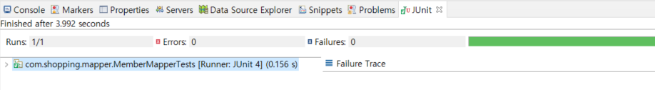

<br>

- 데이터베이스에서 확인

  ```sql
  SELECT * FROM book_member;
  ```

  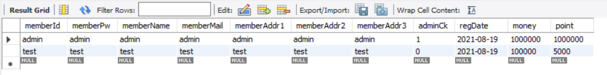

<br>

---

### 5) MemberService.java

- src/main/java - com.shopping.service - MemberService.java 인터페이스, MemberServiceImpl.java 클래스 추가

  - MemberServiceImpl.java 클래스는 MemberService.java 인터페이스 상속받도록 설정
  - **주의해야 할 점! MemberServieImpl.java 클래스에 @Service 어노테이션 반드시 추가**

- MemberService.java

  ```java
  package com.shopping.service;
  
  import com.shopping.model.MemberVO;
  
  public interface MemberService {
  	//회원가입
  	public void memberJoin(MemberVO member) throws Exception;
  }
  ```

- MemberServiceImpl.java

  ```java
  package com.shopping.service;
  
  import org.springframework.beans.factory.annotation.Autowired;
  import org.springframework.stereotype.Service;
  
  import com.shopping.mapper.MemberMapper;
  import com.shopping.model.MemberVO;
  
  @Service
  public class MemberServiceImpl implements MemberService{
  
  	@Autowired
  	MemberMapper membermapper;
  
  	@Override
  	public void memberJoin(MemberVO member) throws Exception {	
  		membermapper.memberJoin(member);
  	}
  }
  ```

  <br>

---

### 6) MemberController.java 회원가입 메서드 추가

- `@autowired`를 통해 MemberService.java가 MemberController.java에 자동 주입되도록 코드 추가

  ```java
  	@Autowired
  	private MemberService memberservice;
  ```

  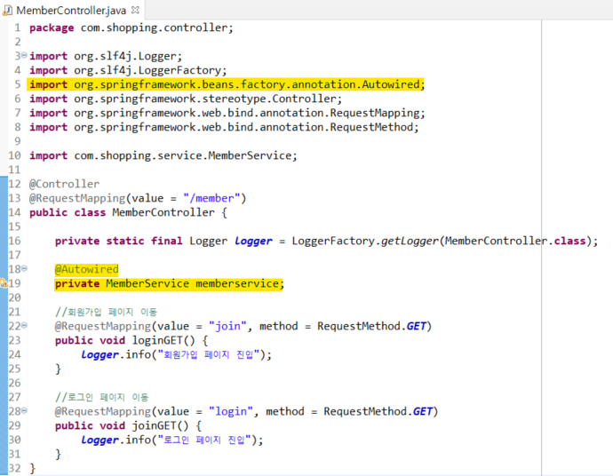

<br>

- 회원가입 메서드 추가

  ```java
  	//회원가입
  	@RequestMapping(value="/join", method=RequestMethod.POST)
  	public String joinPOST(MemberVO member) throws Exception{
  		
  		logger.info("join 진입");
  		
  		// 회원가입 서비스 실행
  		memberservice.memberJoin(member);
  		logger.info("join Service 성공");
  		return "redirect:/main";
  	}
  ```

  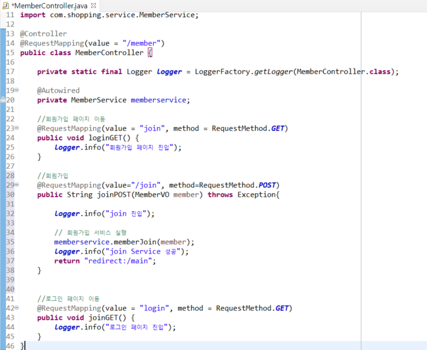

<br>

---

### 7) join.jsp

- input 태그

  - 속성 name 태그 추가
  - MemberVO에서 정의한 변수 이름 삽입
  - id, pw, ... 등 input 태그 전체 변경

  ```jsp
  <%-- 기존 --%>
  <input class="id_input">
  <%-- 변경--%>
  <input class="id_input" name="memberId">
  ```

  ```jsp
  <%-- 기존 --%>
  <input class="pw_input">
  <%-- 변경--%>
  <input class="pw_input" name="memberPw">
  ```

  

- form 태그

  - 기존에 있던 action 속성 삭제
  - id 속성, method 속성 추가

  ```jsp
  <%-- 기존 --%>
  <form action="">
  <%-- 변경--%>
  <form id="join_form" method="post">
  ```

- script 태그 추가

  - jquery 사용을 위해
  - head 태그 내부 가장 끝에 추가

  ```jsp
  <script
    src="https://code.jquery.com/jquery-3.4.1.js"
    integrity="sha256-WpOohJOqMqqyKL9FccASB9O0KwACQJpFTUBLTYOVvVU="
    crossorigin="anonymous"></script>
  ```

  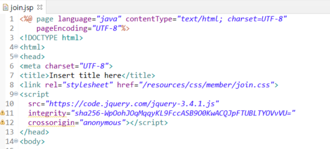

- script 태그 추가

  - body 태그 제일 아래에 추가
  - jquery 코드 추가
  - 가입하기 버튼을 클릭하였을 때, form 태그에 속성 action(url경로)이 추가되고, form 태그가 서버에 제출된다는 의미

  ```jsp
  <script>
  $(document).ready(function(){
  	//회원가입 버튼(회원가입 기능 작동)
  	$(".join_button").click(function(){
  		$("#join_form").attr("action", "/member/join");
  		$("#join_form").submit();
  	});
  });
  </script>
  ```

  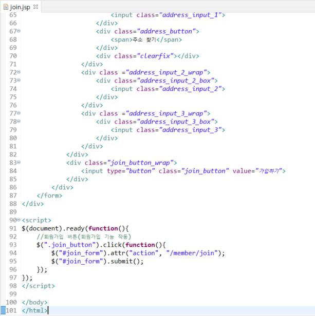

<br>

---

### 8. 테스트

- 회원가입 기능 테스트

  - 회원가입 - 데이터 입력 후 가입하기 클릭 - 데이터베이스에 입력되고 메인페이지로 이동될 것

  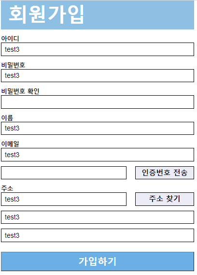

  - 데이터베이스에서 확인

    ```sql
    select * from book_member;
    ```

    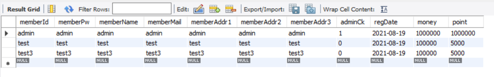

