## 3. 아이디 중복 검사 기능

> - 목차
>   1. < span > 태그 추가
>   2. 아이디 중복검사 메서드 작성 및 테스트
>   3. ajax 작성
>   4. controller 작성
>   5. mapper / service 작성
>      - mapper
>      - service
>   6. ajax success 작성
>   7. 테스트

<br>

### 1) < span > 태그 추가

- join.jsp 

  - id_input_box인 div 태그 아래에 span 태그 2개 추가
  - 각각의 span 태그에 class="id_input_re_1"와 class="id_input_re_2" 속성 추가

  ```jsp
  				<span class="id_input_re_1">사용 가능한 아이디입니다.</span>
  				<span class="id_input_re_2">아이디가 이미 존재합니다.</span>
  ```

  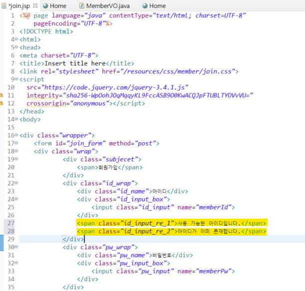

<br>

- join.css 에 코드 추가

  ```css
  /* 중복아이디 존재하지 않는경우 */
  .id_input_re_1{
      color : green;
      display : none;
  }
  /* 중복아이디 존재하는 경우 */
  .id_input_re_2{
      color : red;
      display : none;
  }
  ```

  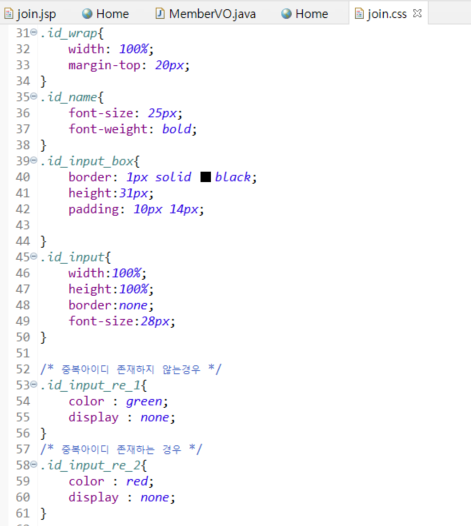

<br>

---

### 2) 아이디 중복검사 메서드 작성 및 테스트

- join.jsp 하단의 < script > 태그에 코드 추가

  - 해당 메서드는 input 태그에 변화가 있을 때마다 실행됨
  - 정상적으로 작동하는지 확인하기 위해 console.log 코드 작성

  ```javascript
  //아이디 중복검사
  $('.id_input').on("propertychange change keyup paste input", function(){
  	console.log("keyup 테스트");	
  });// function 종료
  ```

  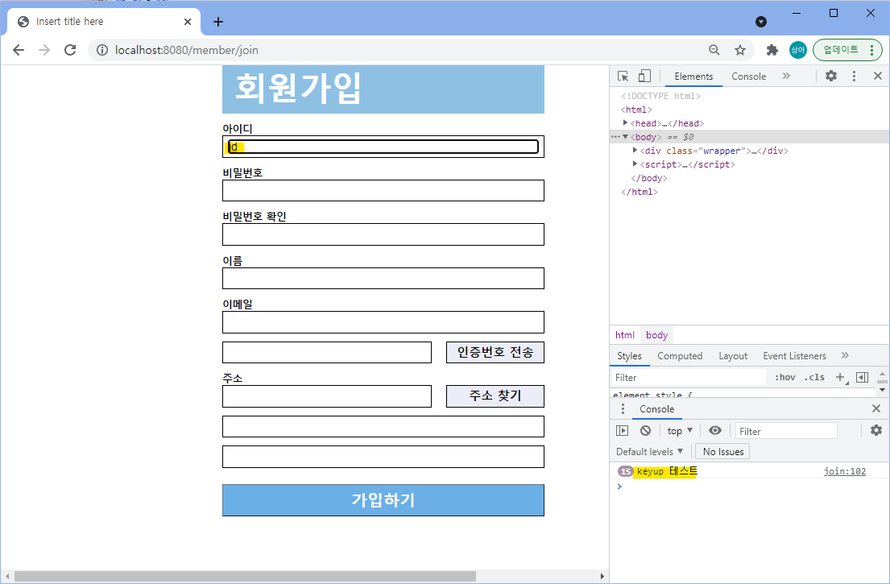

<br>

- 제대로 작동하는지 확인 후 console.log() 주석처리한다.

---

### 3) ajax 작성

```javascript
//아이디 중복검사
$('.id_input').on("propertychange change keyup paste input", function(){
	/* console.log("keyup 테스트");	*/
	var memberId = $('.id_input').val();			// .id_input에 입력되는 값
	var data = {memberId : memberId}				// '컨트롤에 넘길 데이터 이름' : '데이터(.id_input에 입력되는 값)'
	
	$.ajax({
		type : "post",
		url : "/member/memberIdChk",
		data : data
	}); // ajax 종료
});// function 종료
```

<br>

---

### 4) Controller 작성

- MemberController.java에 아이디 중복검사를 실행하는 메서드 작성

- 주의할 점! `@ResponseBody` 어노테이션 추가하지 않으면 join.jsp로 메서드 결과가 반환되지 않음

- join.jsp에서 작성한 ajax 요청을 memberIdChkPOST 메서드가 수신받는지 확인하기 위해 logger.info() 추가

  ```java
  	// 아이디 중복 검사
  	@RequestMapping(value = "/memberIdChk", method = RequestMethod.POST)
  	@ResponseBody
  	public void memberIdChkPOST(String memberId) throws Exception{
  		logger.info("memberIdChk() 진입");
  	} // memberIdChkPOST() 종료
  ```

  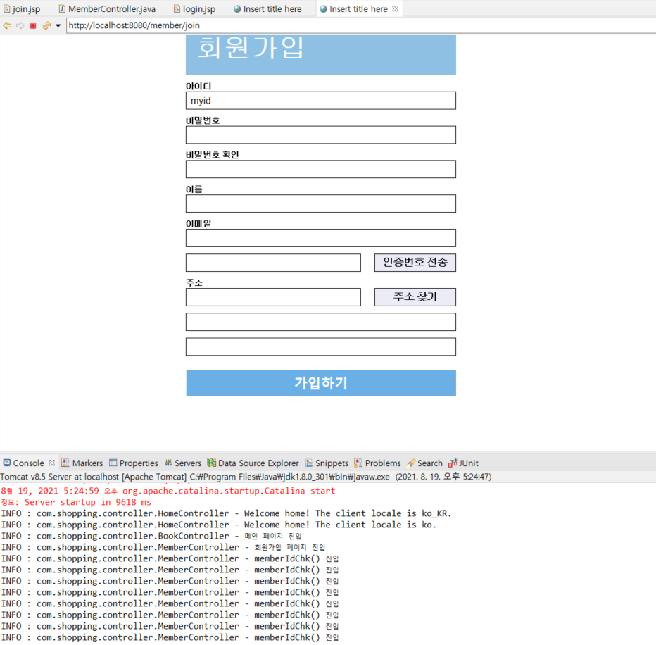

<br>

- MemberController.java

  - 테스트 후 logger.info 주석처리 혹은 삭제
  - 메서드의 반환 타입 void -> String으로 변경
  - 다음 코드 추가

  ```java
  		logger.info("memberIdChk() 진입");
  		int result = memberservice.idCheck(memberId);
  		logger.info("결과값 = " + result);
  		
  		if(result != 0) {
  			return "fail";	// 중복 아이디가 존재
  		} else {
  			return "success";	// 중복 아이디 x
  		}
  ```

  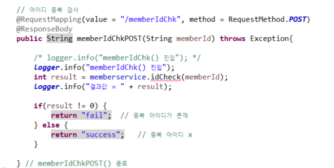

  - idCheck에 빨간색 경고표시 뜨는 이유는 아직 MemberService에서 해당 메서드를 만들지 않았기 때문

    <br>

---

(+) 경로에 한글이 있어 오류가 발생하였다. pom.xml에 다음 코드를 추가해주어 해결했다.

```xml
<dependency>
    <groupId>xerces</groupId>
    <artifactId>xercesImpl</artifactId>
    <version>2.9.1</version>
</dependency>
```

<br>

---

### 5) Mapper / Service 작성

#### (1) Mapper

- MemberMapper.xml에 코드 추가

  ```xml
    	<!-- 아이디 중복검사 -->
    	<select id="idCheck" resultType="int">
    		select count(*) from book_member where memberId = #{memberId}
    	</select>
  ```

- MemberMapper.java에 코드 추가

  ```java
  	// 아이디 중복 검사
  	public int idCheck(String memberId);
  ```

- 작성한 Mapper 메서드가 작동하는지 확인하기 위해 MemberMapperTests.java에 코드 추가하여 테스트

  - 기존의 MemberJoin() 메서드는 삭제 또는 주석처리

    ```java
    	// 아이디 중복검사
    	@Test
    	public void memberIdChk() throws Exception{
    		String id = "admin";	// 존재하는 아이디
    		String id2 = "test123";	// 존재하지 않는 아이디
    		membermapper.idCheck(id);
    		membermapper.idCheck(id2);
    	}
    ```

  - JUnit 테스트 결과

    - 존재하는 아이디는 1, 존재하지 않는 아이디는 0으로 나오는 것을 확인할 수 있다.

    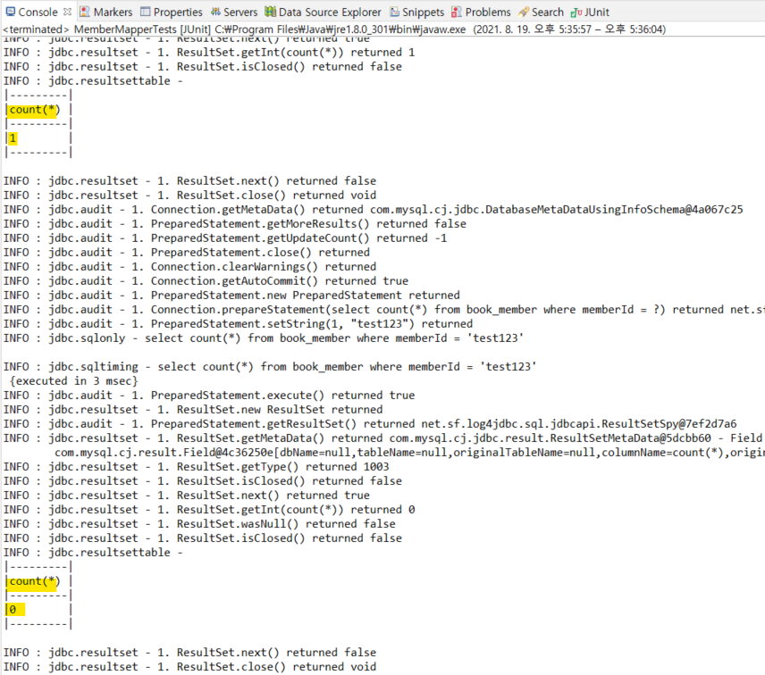

<br>

#### (2) Service

- MemberService.java 에 코드 추가

  ```java
  	// 아이디 중복 검사
  	public int idCheck(String memberId) throws Exception;
  ```

- MemberServiceImpl에 코드 추가

  ```java
  	@Override
  	public int idCheck(String memberId) throws Exception {
  		return membermapper.idCheck(memberId);
  	}
  ```

<br>

---

### 6) ajax success 작성

#### (1) success 코드 추가 및 테스트 

- join.jsp - 아이디 중복검사 내 ajax에 success 코드 추가

  ```javascript
  ,
  		success : function(result){
  			 console.log("성공 여부" + result);
  			
  		}// success 종료
  ```

  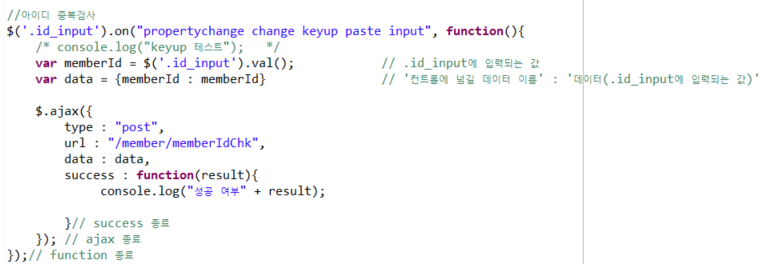

<br>

- 서버 구동하여 id란에 문자 기입하여 테스트 진행

  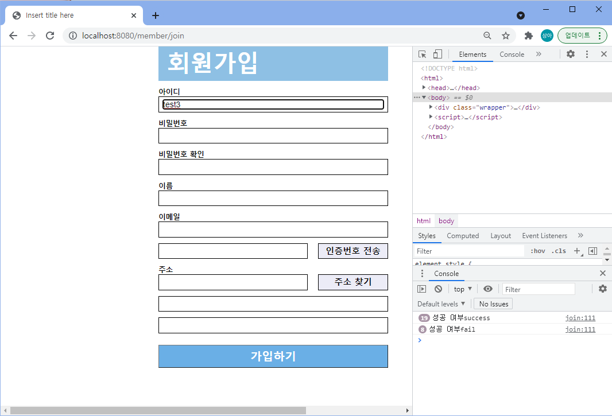


<br>

#### (2) success 내용 추가

- console.log 삭제 혹은 주석처리하기

- success 메서드의 내용에 아래 코드 추가

  ```javascript
  			// console.log("성공 여부" + result);
  			if(result != 'fail'){
  				$('.id_input_re_1').css("display","inline-block");
  				$('.id_input_re_2').css("display", "none");				
  			} else {
  				$('.id_input_re_2').css("display","inline-block");
  				$('.id_input_re_1').css("display", "none");				
  			}
  ```

  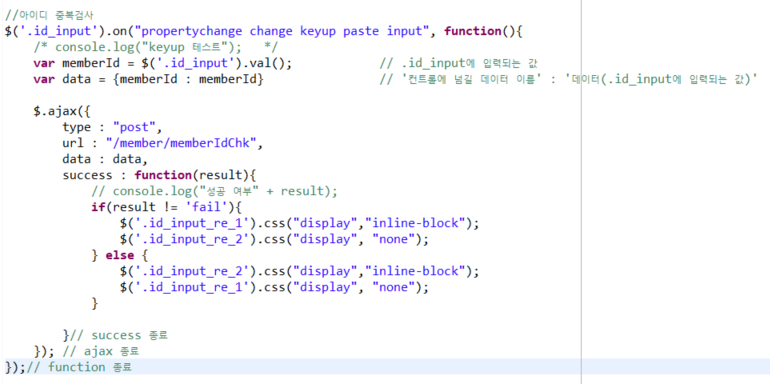

<br>

---

### 7) 최종 테스트

- 존재하는 아이디 삽입 경우

  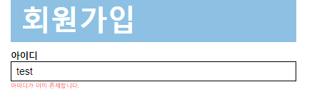


- 존재하지 않는 아이디 삽입 경우

  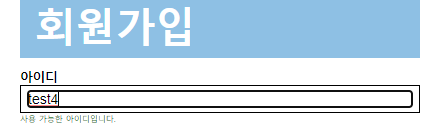