## 4. 인증번호 이메일 전송

> - 목차
>
>   1. 이메일 전송 환경 세팅
>
>   2. 메서드 및 속성 추가
>      - 인증번호 입력란 색상 변경 및 disabled 속성 추가
>      - 이메일 전송 메서드 추가
>      - Controller 메서드 추가
>      - 테스트
>
>   
>
>   3. 인증번호
>      - 인증번호 생성
>      - 인증번호 전송
>        - 이메일 전송
>        - 인증번호 뷰(회원가입 페이지)로 전송
>      - 인증번호 입력란 변환 기능
>      - 인증번호 일치여부 검사 기능
>      - 테스트

<br>

### 1) 이메일 전송 환경 세팅

#### (1) pom.xml 설정 (라이브러리 추가)

- pom.xml에 추가

  ```xml
          <!-- https://mvnrepository.com/artifact/javax.mail/mail -->
          <dependency>
              <groupId>javax.mail</groupId>
              <artifactId>mail</artifactId>
              <version>1.4.7</version>
          </dependency>        
          
          <!-- https://mvnrepository.com/artifact/org.springframework/spring-context-support -->
          <dependency>
              <groupId>org.springframework</groupId>
              <artifactId>spring-context-support</artifactId>
              <version>${org.springframework-version}</version>
          </dependency>
  ```

<br>

#### (2) mailSender Bean 등록

- 메일 서버에 계정 인증 후 메일 전송하는 방법 이용

- 네이버 이메일 이용

- root-context.xml에 아래 코드 추가

  - smtp.port는 SMTP서버와 통신하는 포트를 말함
  - gmail: 465, Naver: 587

  ```xml
  	<!-- navermail설정 -->
      <bean id="mailSender" class="org.springframework.mail.javamail.JavaMailSenderImpl"> 
       	<property name="host" value="smtp.naver.com"/> <!-- 메이서버 호스트 -->
       	<property name="port" value="587"/> <!-- 메이서버 포트번호 -->
       	<property name="username" value="your_email"/> <!-- 자신의 이메일 아이디 -->
       	<property name="password" value="your_password"/> <!-- 자신의 비밀번호 -->
         <!-- 보안연결 SSL과 관련된 설정 -->
       	<property name="javaMailProperties">
        		<props>
        		<prop key="mail.smtp.auth">true</prop>
        		<prop key="mail.smtp.starttls.enable">true</prop>
        		<prop key="mail.smtps.checkserveridentity">true</prop>
        		<prop key="mail.smtps.ssl.trust">*</prop>
              <prop key="mail.smtp.ssl.protocols">TLSv1.2</prop>
        		<prop key="mail.debug">true</prop>
        		<prop key="mail.smtp.socketFactory.class">javax.net.ssl.SSLSocketFactory</prop>
        		</props>
       	</property>
      </bean>
  ```

  <br>

---

(+) 메일 전송 오류 

Authentication failed; nested exception is javax.mail.AuthenticationFailedException: 535 5.7.1 Username and Password not accepted y7pCRoLBTtG47yum2i1akg - nsmtp

```xml
<prop key="mail.smtp.ssl.protocols">TLSv1.2</prop>
```

코드를 추가해주니 해결되었다. ([참고사이트](https://heestory217.tistory.com/124))


---

#### (3) 네이버 메일 설정

- 네이버 메일 페이지에서 왼쪽 최하단 '환경설정' 

  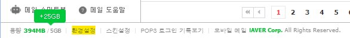

- POP3/IMAP 설정

  

- PTP3/IMAP 설정 - 사용함

  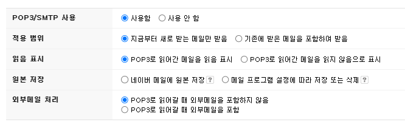

<br>

---

### 2) 메서드 및 속성 추가

#### (1) 인증번호 입력란 색상 변경 및 disabled 속성 추가

#### - 입력란 색상 변경

- join.jsp

  - class명이 mail_check_input_box 인 div 태그에 id속성 mail_check_input_box_false 를 추가한다.

  ```javascript
  /* 변경 전 */
  <div class="mail_check_input_box">
   
  /* 변경 후 */
  <div class="mail_check_input_box" id="mail_check_input_box_false">
  ```

  

- join.css

  - false에는 회색, true에는 투명 또는 흰색 설정

  - 추후 색상 변경시 해당 태그 id값만 변경하면 됨

    ```css
    #mail_check_input_box_false{
        background-color:#ebebe4;
    }
     
    #mail_check_input_box_true{
        background-color:white;
    }
    ```

    <br>

#### - disabled 속성 추가

- join.jsp	

  - class가 mail_check_input 인 input 태그에 disabled 속성 추가

    ```javascript
    /* 변경 전 */
    <input class="mail_check_input">
     
    /* 변경 후 */
    <input class="mail_check_input" disabled="disabled">
    ```

  <br>

#### (2) 이메일 전송 메서드 추가

- 이메일 입력란에 이메일을 입력 후 [인증번호 전송] 버튼을 클릭하면 작동하는 메서드를 추가
- controller로 작성한 이메일 주소를 보내고, 인증번호를 생성하여 전달받은 이메일로 전송한 뒤 전송된 인증번호를 뷰(회원가입 페이지)로 다시 반환되도록 한다. 
- controller에 요청할 때 화면이 전환되면 안 되므로 ajax 사용

<br>

- join.jsp

  - class가 mail_check_button인 input 태그

    ```javascript
    /* 인증번호 이메일 전송 */
    $(".mail_check_button").click(function(){
        var email = $(".mail_input").val();        // 입력한 이메일
        $.ajax({
            type:"GET",
            url:"mailCheck?email=" + email    
        });
    });
    ```

    <br>

#### (3) Controller 메서드 추가

- 인증번호를 생성하여 이메일과 뷰로 보내는 기능 수행


#### - ajax에서 요청 실행하는 메서드 추가

- MemberController.java
  - 뷰(회원가입페이지)로 온전히 데이터를 전송하기 위해 `@ResponseBody` 어노테이션 필요
  - 뷰에서 전송한 데이터를 확인하기 위해 logger를 추가

  ```javascript
      /* 이메일 인증 */
      @RequestMapping(value="/mailCheck", method=RequestMethod.GET)
      @ResponseBody
      public void mailCheckGET(String email) throws Exception{
          
          /* 뷰(View)로부터 넘어온 데이터 확인 */
          logger.info("이메일 데이터 전송 확인");
          logger.info("인증번호 : " + email);
      }
  ```

<br>

#### (4) 테스트

- 입력란에 테스트할 데이터를 입력 후 인증번호 전송을 클릭 - Console에 데이터 정상적으로 넘어오는지 확인

  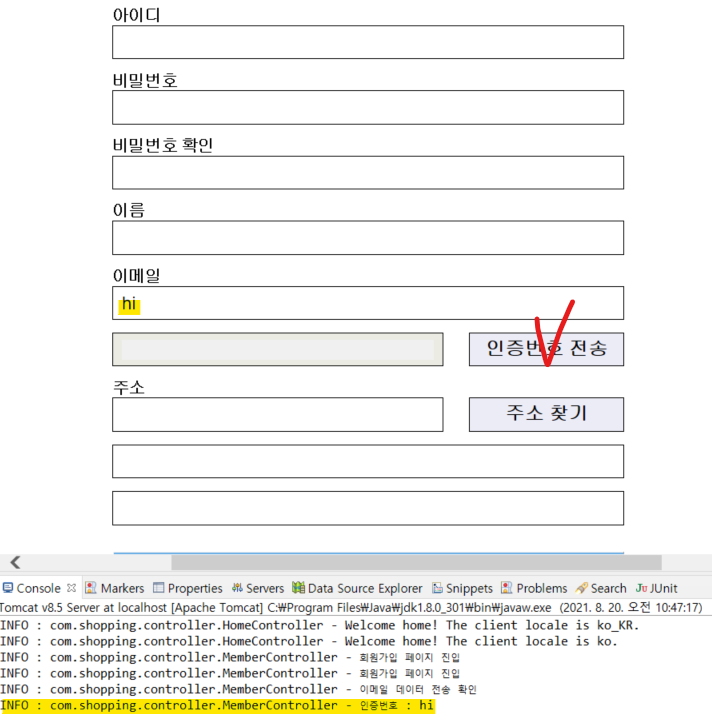

<br>

---

### 3) 인증번호

#### (1) 인증번호 생성

- MemberController.java

  - JAVA의 Random 클래스를 이용하여 객체변수 random 선언

  - random.nextInt() 함수로 난수 생성

  - checkNum 변수 선언하고 난수 생성 결과값 할당

  - 인증번호가 정상적으로 생성되었는지 확인하기 위해 logger 추가

    ```java
            /* 인증번호(난수) 생성 */
            Random random = new Random();
            int checkNum = random.nextInt(888888) + 111111;
    		logger.info("인증번호 " + checkNum);
    ```

    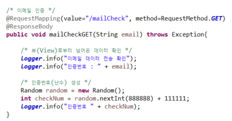

  <br>

#### (2) 인증번호 전송

#### - 이메일 전송

 - MemberController.java

   ```java
           /* 이메일 보내기 */
           String setFrom = "sjinjin6@naver.com";
           String toMail = email;
           String title = "회원가입 인증 이메일 입니다.";
           String content = 
                   "홈페이지를 방문해주셔서 감사합니다." +
                   "<br><br>" + 
                   "인증 번호는 " + checkNum + "입니다." + 
                   "<br>" + 
                   "해당 인증번호를 인증번호 확인란에 기입하여 주세요.";
   ```

   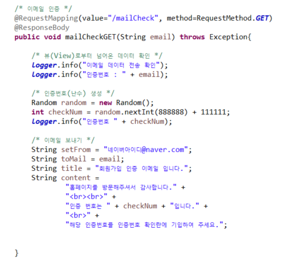

 <br>

- MemberController.java 

  - 상단에 JavaMailSender 객체 타입인 mailSender 변수 선언

  - 의존성 주입 사용을 위해 `@Autowired` 어노테이션 사용

    ```java
        @Autowired
        private JavaMailSender mailSender;
    ```

    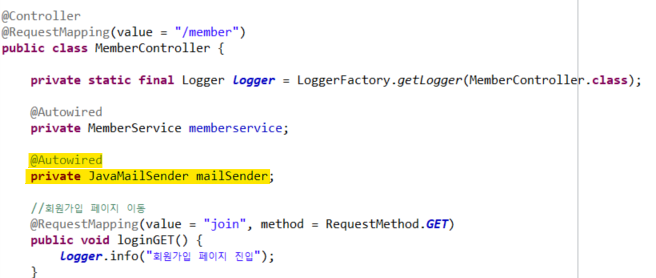

  - 이메일 전송을 위한 코드 삽입

    ```java
            try {
                
                MimeMessage message = mailSender.createMimeMessage();
                MimeMessageHelper helper = new MimeMessageHelper(message, true, "utf-8");
                helper.setFrom(setFrom);
                helper.setTo(toMail);
                helper.setSubject(title);
                helper.setText(content,true);
                mailSender.send(message);
                
            }catch(Exception e) {
                e.printStackTrace();
            }
    ```

    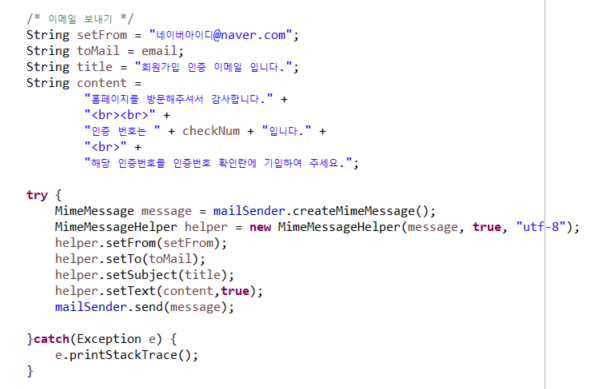

- 이메일 정상적으로 전송되는지 테스트  

  - 이메일 입력 후 인증번호 전송

    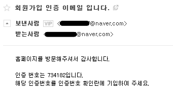

  <br>

#### - 인증번호 뷰(회원가입 페이지)로 전송

- MemberController.java
  - 생성한 인증번호 변수를 뷰로 반환해야 한다. ajax를 통한 요청으로 인해 뷰로 반환할 때 데이터 타입은 String 타입만 가능하다. String 타입으로 변환 후 반환해주자. 

    ```java
    public String mailCheckGET(String email) throws Exception{
    ```

    

  - 변수 num을 선언하고 인증번호(checkNum)를 string으로 형변환한 값을 할당한다. 

    ```java
        String num = Integer.toString(checkNum);
    	return num;
    ```

  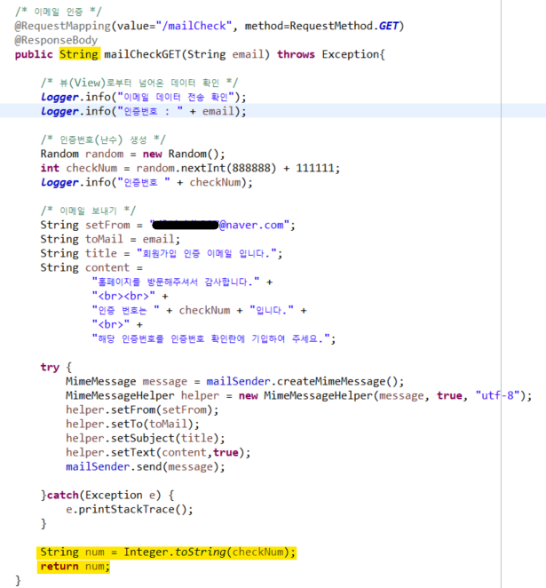

<br>

- join.jsp에 이메일 인증번호 전송을 요청한 ajax에 success 코드 추가

  ```javascript
          ,
  		success:function(data){
              console.log("data : " + data);
          }
  ```

  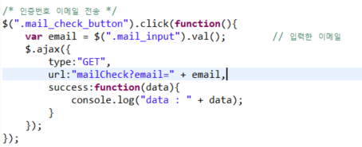

- 테스트 진행

  - try부분은 잠시 주석처리해서 테스트 (Controller로부터 데이터가 정상적으로 반환되는지만 확인하면 되기 때문에)

  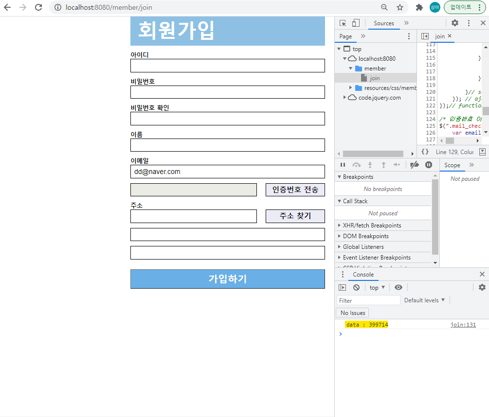

<br>

#### (3) 인증번호 입력란 변환 

- 인증번호 입력란(mail_check_input)에 사용할 수 있도록 두 가지 기능 실행
  1. 인증번호 입력란 태그의 속성 disabled 속성 값 변경
  2. 인증번호 입력란의 배경색 변경

- join.jsp

  - checkBox, boxWrap 변수 선언 및 할당

    ```javascript
        var checkBox = $(".mail_check_input");        // 인증번호 입력란
        var boxWrap = $(".mail_check_input_box");    // 인증번호 입력란 박스
    ```

  - 이메일 인증 입력란에 입력 가능하도록 속성 변경

    ```javascript
                //console.log("data : " + data);
                checkBox.attr("disabled",false);
    ```

  - success 코드 안에 이메일 인증 입력란의 색상이 변경되도록 (회색 -> 흰색) 해당 태그 id속성값 변경해주는 코드 추가

    ```javascript
    boxWrap.attr("id", "mail_check_input_box_true");
    ```

  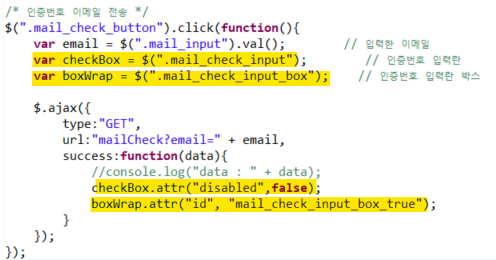

<br>

#### (4) 인증번호 일치여부 검사

- 입력된 인증번호와 이메일로 전송된 인증번호 비교는 Controller가 아닌 View에서 진행

- join.jsp 

  - 스크립트 상단에 code 변수 선언 

    ```javascript
    var code = "";           // 이메일전송 인증번호 저장 위한 코드
    ```

  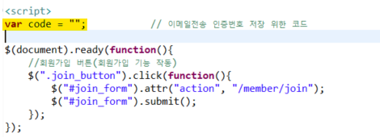

  - 인증번호 이메일 전송 메서드 내의 ajax success 코드에 Controller로부터 전달받은 인증번호를 code 변수에 저장하는 코드 추가

    ```javascript
    code = data;
    ```

  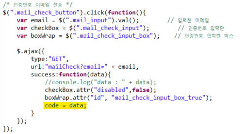

  - span 태그 추가(인증번호의 일치여부 알려주는 경고글 역할)

    ```jsp
    <span id = "mail_check_input_box_warn"></span>
    ```

    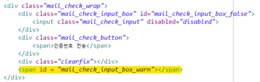

<br>

- join.css

  - 인증여부 일치여부에 따른 span 태그 글 색상 변경

    ```css
    .correct{
        color : green;
    }
    .incorrect{
        color : red;
    }
    ```

    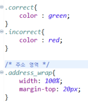

- join.jsp

  - 인증번호 비교 - 입력란에 데이터 입력 후 마우스로 다른 곳 클릭 시 실행

    ```javascript
    /* 인증번호 비교 */
    $(".mail_check_input").blur(function(){
        var inputCode = $(".mail_check_input").val();        // 입력코드    
        var checkResult = $("#mail_check_input_box_warn");    // 비교 결과 
    });
    ```

    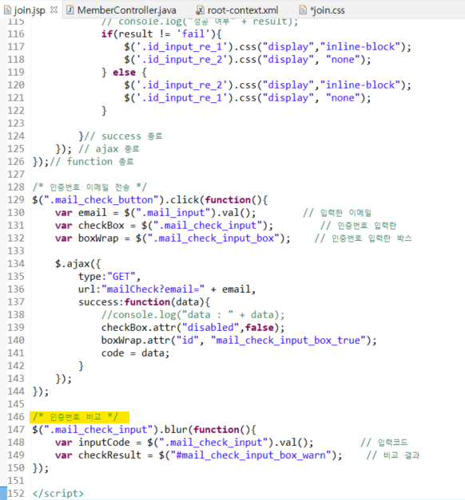

  <br>

  - 인증번호 일치 여부에 따라 다른 코드 실행하는 if문 추가

    ```javascript
        if(inputCode == code){                            // 일치할 경우
            checkResult.html("인증번호가 일치합니다.");
            checkResult.attr("class", "correct");        
        } else {                                            // 일치하지 않을 경우
            checkResult.html("인증번호를 다시 확인해주세요.");
            checkResult.attr("class", "incorrect");
        }   
    ```

    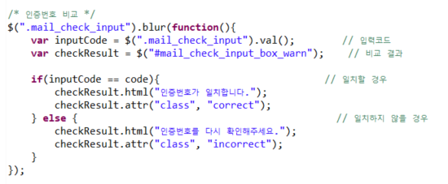

<br>

#### (5) 테스트

- 인증번호 일치할 경우


- 인증번호 일치하지 않을 경우


